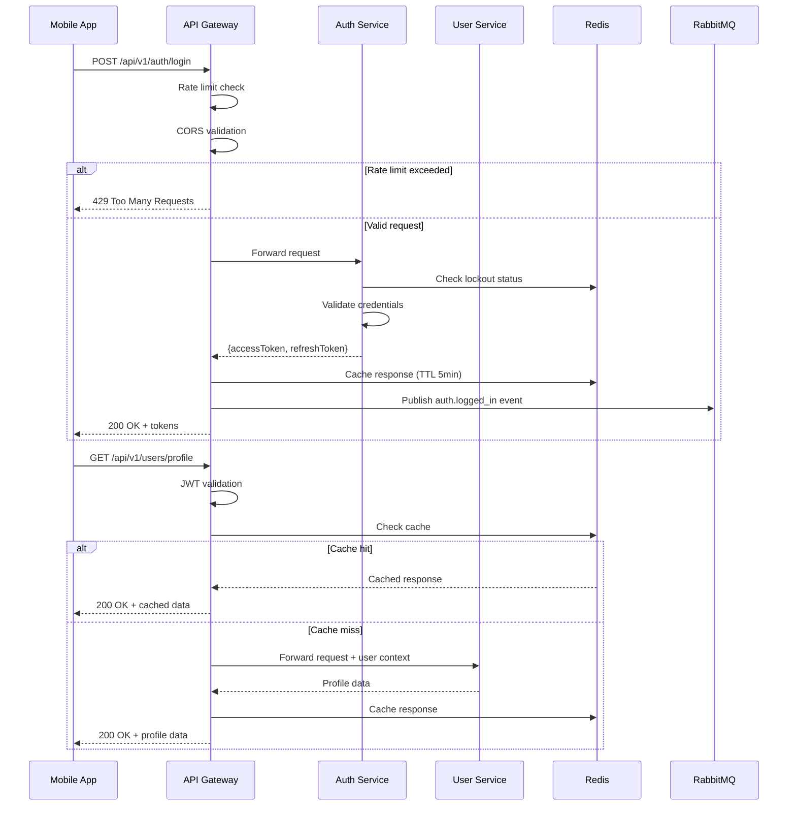

# Спецификация API Gateway

**Версия:** 1.0
**Дата:** 13 марта 2026 г.
**Статус:** Готово к разработке

---

## 1. Архитектура API Gateway

### 1.1. Обзор и зона ответственности

**API Gateway** — это центральный шлюз для маршрутизации всех клиентских запросов к микросервисам платформы StreetEye.

**Входит в зону ответственности:**
- ✅ Маршрутизация запросов к микросервисам
- ✅ JWT аутентификация и авторизация
- ✅ Rate limiting и throttling
- ✅ Кэширование ответов
- ✅ Логирование и мониторинг
- ✅ CORS и HTTPS termination
- ✅ Request/Response валидация
- ✅ Circuit breaker для отказоустойчивости
- ✅ Health checks микросервисов

**НЕ входит в зону ответственности:**
- ❌ Бизнес-логика (в микросервисах)
- ❌ Хранение данных (в микросервисах)
- ❌ Обработка платежей (в User Service)
- ❌ Отправка уведомлений (в Notification Service)
- ❌ AI-анализ фотографий (в AI Service)

### 1.2. Взаимодействие с микросервисами



**Таблица маршрутизации:**

| Префикс | Сервис | Порт | Протокол | Auth Required |
|---------|--------|------|----------|---------------|
| `/api/v1/auth/*` | Auth Service | 3001 | REST | No (except logout) |
| `/api/v1/users/*` | User Service | 3002 | REST | Yes |
| `/api/v1/challenges/*` | Challenge Service | 3003 | REST | Optional |
| `/api/v1/marathons/*` | Marathon Service | 3004 | REST | Yes |
| `/api/v1/progress/*` | Progress Service | 3005 | REST | Yes |
| `/api/v1/ai/*` | AI Service | 3006 | REST/gRPC | Yes |
| `/api/v1/notifications/*` | Notification Service | 3007 | REST | Yes |
| `/api/v1/geo/*` | Geo Service | 3008 | REST | Optional |
| `/api/v1/files/*` | File Service | 3009 | REST | Yes |
| `/api/v1/analytics/*` | Analytics Service | 3010 | REST/gRPC | Admin only |

### 1.3. Внутренняя структура модулей

```
api-gateway/
├── src/
│   ├── main.ts                          # Точка входа
│   ├── app.module.ts                    # Главный модуль
│   ├── config/                          # Конфигурация
│   │   ├── database.config.ts
│   │   ├── redis.config.ts
│   │   ├── rabbitmq.config.ts
│   │   └── gateway.config.ts
│   ├── gateway/                         # Основной модуль
│   │   ├── gateway.module.ts
│   │   ├── controllers/
│   │   │   └── proxy.controller.ts
│   │   ├── services/
│   │   │   ├── proxy.service.ts
│   │   │   ├── health.service.ts
│   │   │   └── circuit-breaker.service.ts
│   │   └── http/
│   │       ├── auth.http.module.ts
│   │       ├── user.http.module.ts
│   │       ├── challenge.http.module.ts
│   │       └── ... (для каждого сервиса)
│   ├── middleware/                      # Middleware
│   │   ├── auth.middleware.ts
│   │   ├── logging.middleware.ts
│   │   ├── rate-limit.middleware.ts
│   │   ├── cache.middleware.ts
│   │   └── cors.middleware.ts
│   ├── interceptors/                    # Interceptors
│   │   ├── logging.interceptor.ts
│   │   ├── cache.interceptor.ts
│   │   └── timeout.interceptor.ts
│   ├── filters/                         # Filters
│   │   └── http-exceptions.filter.ts
│   ├── guards/                          # Guards
│   │   ├── jwt-auth.guard.ts
│   │   └── roles.guard.ts
│   └── events/                          # События
│       └── gateway.events.ts
```

---

## 2. Конфигурация маршрутизации

### 2.1. /api/v1/auth/*

**Target Service:** Auth Service (порт 3001)

**Method Forwarding:**
- GET → GET
- POST → POST
- PUT → PUT
- DELETE → DELETE

**Authentication:** Optional (требуется только для logout)

**Rate Limiting:**
- Anonymous: 100 запросов/мин
- Authenticated: 1000 запросов/мин

**Caching:**
- Enabled: false (аутентификационные запросы не кэшируются)

**Timeout:** 30 секунд

**Retry Policy:**
- Max retries: 3
- Backoff: exponential (1s, 2s, 4s)

**Special Routes:**

| Route | Method | Auth | Rate Limit | Description |
|-------|--------|------|------------|-------------|
| `/auth/register` | POST | No | 5/мин | Регистрация нового пользователя |
| `/auth/login` | POST | No | 10/мин | Аутентификация пользователя |
| `/auth/refresh` | POST | No | 30/мин | Обновление access token |
| `/auth/logout` | POST | Yes | 10/мин | Выход из системы |
| `/auth/verify-email` | POST | No | 10/мин | Подтверждение email |
| `/auth/password/reset` | POST | No | 3/час | Сброс пароля |
| `/auth/2fa/*` | POST | Yes | 10/мин | 2FA операции |

---

### 2.2. /api/v1/users/*

**Target Service:** User Service (порт 3002)

**Method Forwarding:**
- GET → GET
- POST → POST
- PUT → PUT
- DELETE → DELETE

**Authentication:** Required

**Rate Limiting:**
- Anonymous: 0 (заблокировано)
- Authenticated: 1000 запросов/мин

**Caching:**
- Enabled: true (для GET запросов)
- TTL: 300 секунд (5 минут)
- Cache Key: `GET:/api/v1/users/{id}/profile:{userId}`

**Timeout:** 30 секунд

**Retry Policy:**
- Max retries: 3
- Backoff: exponential

**Special Routes:**

| Route | Method | Auth | Rate Limit | Cache | Description |
|-------|--------|------|------------|-------|-------------|
| `/users/:id/profile` | GET | Yes | 60/мин | Yes | Получение профиля |
| `/users/:id/profile` | PUT | Yes | 10/мин | No | Обновление профиля |
| `/users/:id/subscription` | GET | Yes | 30/мин | Yes | Текущая подписка |
| `/users/:id/subscription/upgrade` | POST | Yes | 5/мин | No | Улучшение подписки |
| `/users/:id/purchases` | GET | Yes | 30/мин | Yes | История покупок |
| `/users/:id/achievements` | GET | Yes | 30/мин | Yes | Достижения |

---

### 2.3. /api/v1/challenges/*

**Target Service:** Challenge Service (порт 3003)

**Method Forwarding:**
- GET → GET
- POST → POST (admin only)
- PUT → PUT (admin only)
- DELETE → DELETE (admin only)

**Authentication:** Optional (требуется для premium challenges)

**Rate Limiting:**
- Anonymous: 100 запросов/мин
- Authenticated: 1000 запросов/мин

**Caching:**
- Enabled: true (для GET запросов)
- TTL: 300 секунд
- Cache Key: `GET:/api/v1/challenges/{path}:{userId}`

**Timeout:** 30 секунд

**Retry Policy:**
- Max retries: 3
- Backoff: exponential

**Special Routes:**

| Route | Method | Auth | Rate Limit | Cache | Description |
|-------|--------|------|------------|-------|-------------|
| `/challenges/random` | GET | Optional | 30/мин | No | Случайное задание |
| `/challenges/:id` | GET | Optional | 60/мин | Yes | Задание по ID |
| `/challenges` | GET | Optional | 30/мин | Yes | Список заданий |
| `/challenges/categories` | GET | No | 60/мин | Yes | Категории |
| `/challenges/heat-mode/*` | POST/GET/DELETE | Yes | 30/мин | No | Heat Mode сессии |

---

### 2.4. /api/v1/marathons/*

**Target Service:** Marathon Service (порт 3004)

**Method Forwarding:**
- GET → GET
- POST → POST
- PUT → PUT

**Authentication:** Required

**Rate Limiting:**
- Anonymous: 0 (заблокировано)
- Authenticated: 500 запросов/мин

**Caching:**
- Enabled: true (для GET запросов)
- TTL: 600 секунд (10 минут)

**Timeout:** 30 секунд

**Retry Policy:**
- Max retries: 3
- Backoff: exponential

---

### 2.5. /api/v1/progress/*

**Target Service:** Progress Service (порт 3005)

**Method Forwarding:**
- GET → GET
- POST → POST
- PUT → PUT

**Authentication:** Required

**Rate Limiting:**
- Anonymous: 0 (заблокировано)
- Authenticated: 500 запросов/мин

**Caching:**
- Enabled: true (для GET запросов)
- TTL: 300 секунд

**Timeout:** 30 секунд

**Retry Policy:**
- Max retries: 3
- Backoff: exponential

---

### 2.6. /api/v1/ai/*

**Target Service:** AI Service (порт 3006)

**Method Forwarding:**
- GET → GET
- POST → POST

**Authentication:** Required (Premium+)

**Rate Limiting:**
- Anonymous: 0 (заблокировано)
- Authenticated: 30 запросов/мин (AI analysis expensive)

**Caching:**
- Enabled: false (AI analysis всегда уникален)

**Timeout:** 120 секунд (AI analysis может быть долгим)

**Retry Policy:**
- Max retries: 1
- Backoff: linear (5s)

---

### 2.7. /api/v1/notifications/*

**Target Service:** Notification Service (порт 3007)

**Method Forwarding:**
- GET → GET
- POST → POST

**Authentication:** Required

**Rate Limiting:**
- Anonymous: 0 (заблокировано)
- Authenticated: 100 запросов/мин

**Caching:**
- Enabled: false

**Timeout:** 30 секунд

**Retry Policy:**
- Max retries: 2
- Backoff: exponential

---

### 2.8. /api/v1/geo/*

**Target Service:** Geo Service (порт 3008)

**Method Forwarding:**
- GET → GET
- POST → POST

**Authentication:** Optional

**Rate Limiting:**
- Anonymous: 100 запросов/мин
- Authenticated: 500 запросов/мин

**Caching:**
- Enabled: true (для GET запросов)
- TTL: 600 секунд

**Timeout:** 30 секунд

**Retry Policy:**
- Max retries: 3
- Backoff: exponential

---

### 2.9. /api/v1/files/*

**Target Service:** File Service (порт 3009)

**Method Forwarding:**
- GET → GET
- POST → POST
- DELETE → DELETE

**Authentication:** Required

**Rate Limiting:**
- Anonymous: 0 (заблокировано)
- Authenticated: 100 запросов/мин (file operations expensive)

**Caching:**
- Enabled: true (для GET запросов файлов)
- TTL: 3600 секунд (1 час)

**Timeout:** 300 секунд (5 минут для больших файлов)

**Retry Policy:**
- Max retries: 2
- Backoff: exponential

---

### 2.10. /api/v1/analytics/*

**Target Service:** Analytics Service (порт 3010)

**Method Forwarding:**
- GET → GET
- POST → POST

**Authentication:** Required (Admin only)

**Rate Limiting:**
- Anonymous: 0 (заблокировано)
- Admin: 100 запросов/мин

**Caching:**
- Enabled: true (для GET запросов)
- TTL: 300 секунд

**Timeout:** 60 секунд

**Retry Policy:**
- Max retries: 2
- Backoff: exponential

---

## 3. Middleware

### 3.1. Authentication Middleware

**Назначение:** JWT валидация токенов и извлечение user context.

**Реализация:**
```typescript
@Injectable()
export class AuthMiddleware implements NestMiddleware {
  constructor(
    private readonly jwtService: JwtService,
    private readonly redisService: RedisService,
  ) {}

  async use(req: Request, res: Response, next: NextFunction) {
    const authHeader = req.headers.authorization;
    
    if (!authHeader || !authHeader.startsWith('Bearer ')) {
      req.user = null; // Anonymous request
      return next();
    }

    const token = authHeader.substring(7);
    
    try {
      // Проверка blacklist
      const isBlacklisted = await this.redisService.get(`blacklist:${token}`);
      if (isBlacklisted) {
        throw new UnauthorizedException('Token revoked');
      }

      // Валидация JWT
      const payload = await this.jwtService.verifyAsync(token);
      
      // Добавление user context к запросу
      req.user = {
        userId: payload.sub,
        email: payload.email,
        role: payload.role || 'user',
        iat: payload.iat,
        exp: payload.exp,
      };

      next();
    } catch (error) {
      req.user = null;
      next(); // Продолжаем как anonymous
    }
  }
}
```

**User Context Interface:**
```typescript
interface UserContext {
  userId: string;
  email: string;
  role: 'user' | 'premium' | 'admin';
  iat: number;
  exp: number;
}
```

---

### 3.2. Rate Limiting Middleware

**Назначение:** Ограничение количества запросов для предотвращения abuse.

**Алгоритм:** Sliding Window Log с Redis storage.

**Реализация:**
```typescript
@Injectable()
export class RateLimitMiddleware implements NestMiddleware {
  constructor(private readonly redisService: RedisService) {}

  async use(req: Request, res: Response, next: NextFunction) {
    const userId = (req.user as UserContext)?.userId || `anon:${req.ip}`;
    const key = `ratelimit:${userId}:${Date.now() - (Date.now() % 60000)}`;
    
    const limit = req.user ? 1000 : 100; // Authenticated vs Anonymous
    const windowMs = 60000; // 1 minute

    const current = await this.redisService.incr(key);
    if (current === 1) {
      await this.redisService.expire(key, Math.ceil(windowMs / 1000));
    }

    if (current > limit) {
      const retryAfter = await this.redisService.ttl(key);
      
      res.setHeader('Retry-After', retryAfter.toString());
      res.setHeader('X-RateLimit-Limit', limit.toString());
      res.setHeader('X-RateLimit-Remaining', '0');
      res.setHeader('X-RateLimit-Reset', (Date.now() + retryAfter * 1000).toString());
      
      throw new TooManyRequestsException({
        code: 'RATE_LIMIT_EXCEEDED',
        message: `Too many requests. Try again in ${retryAfter} seconds.`,
      });
    }

    // Headers для клиента
    res.setHeader('X-RateLimit-Limit', limit.toString());
    res.setHeader('X-RateLimit-Remaining', (limit - current).toString());
    res.setHeader('X-RateLimit-Reset', (Date.now() + windowMs).toString());

    next();
  }
}
```

**Лимиты по типам пользователей:**

| Тип пользователя | Лимит/мин | Лимит/час | Лимит/день |
|-----------------|-----------|-----------|------------|
| Anonymous | 100 | 1,000 | 10,000 |
| Authenticated | 1,000 | 10,000 | 100,000 |
| Premium | 2,000 | 20,000 | 200,000 |
| Admin | 10,000 | 100,000 | 1,000,000 |

---

### 3.3. Logging Middleware

**Назначение:** Логирование всех запросов для мониторинга и отладки.

**Формат логов:** JSON с correlation ID для трассировки.

**Реализация:**
```typescript
@Injectable()
export class LoggingMiddleware implements NestMiddleware {
  private readonly logger = new Logger('HTTP');

  use(req: Request, res: Response, next: NextFunction) {
    const { ip, method, originalUrl } = req;
    const userId = (req.user as UserContext)?.userId || 'anonymous';
    const correlationId = req.headers['x-correlation-id'] as string || randomUUID();
    
    const startTime = Date.now();

    // Добавляем correlation ID к ответу
    res.setHeader('X-Correlation-ID', correlationId);

    next();

    // Логирование после завершения запроса
    res.on('finish', () => {
      const { statusCode } = res;
      const contentLength = res.get('content-length');
      const responseTime = Date.now() - startTime;

      const logEntry = {
        timestamp: new Date().toISOString(),
        correlationId,
        method,
        path: originalUrl,
        statusCode,
        responseTime: `${responseTime}ms`,
        contentLength: contentLength || 0,
        userId,
        ip,
        userAgent: req.get('user-agent'),
      };

      if (statusCode >= 500) {
        this.logger.error(JSON.stringify(logEntry));
      } else if (statusCode >= 400) {
        this.logger.warn(JSON.stringify(logEntry));
      } else {
        this.logger.log(JSON.stringify(logEntry));
      }
    });
  }
}
```

**Пример лога:**
```json
{
  "timestamp": "2024-03-13T10:30:00.000Z",
  "correlationId": "550e8400-e29b-41d4-a716-446655440000",
  "method": "POST",
  "path": "/api/v1/auth/login",
  "statusCode": 200,
  "responseTime": "125ms",
  "contentLength": 512,
  "userId": "anonymous",
  "ip": "192.168.1.100",
  "userAgent": "StreetEye-iOS/1.0.0"
}
```

---

### 3.4. Caching Middleware

**Назначение:** Кэширование ответов для уменьшения нагрузки на микросервисы.

**Стратегия:** Cache-aside с Redis.

**Реализация:**
```typescript
@Injectable()
export class CacheMiddleware implements NestMiddleware {
  constructor(private readonly redisService: RedisService) {}

  async use(req: Request, res: Response, next: NextFunction) {
    // Кэшируем только GET запросы
    if (req.method !== 'GET') {
      return next();
    }

    const userId = (req.user as UserContext)?.userId || 'anonymous';
    const cacheKey = `${req.method}:${req.originalUrl}:${userId}`;

    try {
      // Проверка кэша
      const cached = await this.redisService.get(cacheKey);
      if (cached) {
        res.setHeader('X-Cache', 'HIT');
        res.setHeader('X-Cache-TTL', (await this.redisService.ttl(cacheKey)).toString());
        return res.json(JSON.parse(cached));
      }

      // Перехват ответа для кэширования
      const originalJson = res.json.bind(res);
      res.json = (data) => {
        // Кэшируем только успешные ответы
        if (res.statusCode === 200) {
          const ttl = this.getCacheTTL(req.originalUrl);
          this.redisService.setex(cacheKey, ttl, JSON.stringify(data));
        }
        return originalJson(data);
      };

      res.setHeader('X-Cache', 'MISS');
      next();
    } catch (error) {
      // При ошибке кэширования продолжаем без кэша
      next();
    }
  }

  private getCacheTTL(path: string): number {
    // Разный TTL для разных endpoints
    if (path.includes('/challenges')) return 300; // 5 минут
    if (path.includes('/users')) return 300; // 5 минут
    if (path.includes('/marathons')) return 600; // 10 минут
    if (path.includes('/files')) return 3600; // 1 час
    return 300; // Default 5 минут
  }
}
```

**Cache Invalidation:**
```typescript
// При изменении данных (POST/PUT/DELETE)
async invalidateCache(userId: string, pathPattern: string): Promise<void> {
  const keys = await this.redisService.keys(`GET:/api/v1/${pathPattern}*:${userId}`);
  if (keys.length > 0) {
    await this.redisService.del(...keys);
  }
}
```

---

### 3.5. Error Handling Middleware

**Назначение:** Унифицированная обработка ошибок и маппинг error codes.

**Реализация:**
```typescript
@Catch()
export class HttpExceptionsFilter implements ExceptionFilter {
  catch(exception: unknown, host: ArgumentsHost) {
    const ctx = host.switchToHttp();
    const response = ctx.getResponse<Response>();
    const request = ctx.getRequest<Request>();

    const status = exception instanceof HttpException
      ? exception.getStatus()
      : HttpStatus.INTERNAL_SERVER_ERROR;

    const errorResponse = this.mapErrorResponse(exception, status);

    // Логирование ошибки
    this.logger.error({
      timestamp: new Date().toISOString(),
      path: request.url,
      method: request.method,
      status,
      error: errorResponse,
      correlationId: request.headers['x-correlation-id'],
    });

    response.status(status).json(errorResponse);
  }

  private mapErrorResponse(exception: unknown, status: number): ErrorResponse {
    if (exception instanceof HttpException) {
      const exceptionResponse = exception.getResponse();
      
      return {
        statusCode: status,
        timestamp: new Date().toISOString(),
        path: this.request?.url || '',
        error: this.getErrorCode(exception),
        message: typeof exceptionResponse === 'string' 
          ? exceptionResponse 
          : (exceptionResponse as any).message || 'Unknown error',
        code: (exceptionResponse as any)?.code || this.getDefaultCode(status),
      };
    }

    // Internal server error
    return {
      statusCode: HttpStatus.INTERNAL_SERVER_ERROR,
      timestamp: new Date().toISOString(),
      path: this.request?.url || '',
      error: 'Internal Server Error',
      message: 'An unexpected error occurred',
      code: 'INTERNAL_ERROR',
    };
  }
}
```

**Error Code Mapping:**

| HTTP Status | Error Code | Description |
|-------------|------------|-------------|
| 400 | `BAD_REQUEST` | Invalid request format |
| 401 | `UNAUTHORIZED` | Missing or invalid token |
| 403 | `FORBIDDEN` | Insufficient permissions |
| 404 | `NOT_FOUND` | Resource not found |
| 409 | `CONFLICT` | Resource conflict |
| 422 | `VALIDATION_ERROR` | Request validation failed |
| 429 | `RATE_LIMIT_EXCEEDED` | Too many requests |
| 500 | `INTERNAL_ERROR` | Internal server error |
| 502 | `BAD_GATEWAY` | Upstream service error |
| 503 | `SERVICE_UNAVAILABLE` | Service temporarily unavailable |
| 504 | `GATEWAY_TIMEOUT` | Upstream service timeout |

---

## 4. Безопасность

### 4.1. JWT Валидация

**Token Verification:**
```typescript
async validateToken(token: string): Promise<UserContext> {
  try {
    // Проверка blacklist
    const isBlacklisted = await this.redis.get(`blacklist:${token}`);
    if (isBlacklisted) {
      throw new UnauthorizedException('Token revoked');
    }

    // Валидация подписи и expiration
    const payload = await this.jwtService.verifyAsync(token, {
      secret: this.configService.get('JWT_SECRET'),
      issuer: 'streetEye',
      audience: 'streetEye-app',
    });

    return {
      userId: payload.sub,
      email: payload.email,
      role: payload.role || 'user',
      iat: payload.iat,
      exp: payload.exp,
    };
  } catch (error) {
    if (error instanceof TokenExpiredError) {
      throw new UnauthorizedException('Token expired');
    }
    if (error instanceof JsonWebTokenError) {
      throw new UnauthorizedException('Invalid token');
    }
    throw error;
  }
}
```

**Refresh Token Handling:**
- Refresh tokens proxyруются к Auth Service
- Gateway не хранит refresh tokens
- При успешном refresh старый access token добавляется в blacklist

---

### 4.2. Rate Limiting

**Алгоритмы:**
1. **Sliding Window Log** (основной) - точный, но требует больше памяти
2. **Token Bucket** (для API limits) - позволяет bursts

**Лимиты:**

| Endpoint Pattern | Anonymous | Authenticated | Premium |
|-----------------|-----------|---------------|---------|
| `/auth/login` | 10/мин | 10/мин | 10/мин |
| `/auth/register` | 5/мин | N/A | N/A |
| `/auth/refresh` | 30/мин | 30/мин | 30/мин |
| `/users/*` | 0 | 60/мин | 120/мин |
| `/challenges/*` | 30/мин | 60/мин | 120/мин |
| `/ai/*` | 0 | 10/мин | 30/мин |
| Все остальные | 100/мин | 1000/мин | 2000/мин |

**Блокировки:**
- 5 превышений лимита за 10 минут → блокировка IP на 1 час
- 10 превышений лимита за 10 минут → блокировка IP на 24 часа

---

### 4.3. CORS

**Конфигурация:**
```typescript
const corsOptions: CorsOptions = {
  origin: [
    'https://streetye.com',
    'https://app.streetye.com',
    'https://admin.streetye.com',
    // Mobile apps
    /^https:\/\/.*\.streetye\.com$/,
  ],
  methods: ['GET', 'POST', 'PUT', 'DELETE', 'PATCH', 'OPTIONS'],
  allowedHeaders: [
    'Content-Type',
    'Authorization',
    'X-Correlation-ID',
    'X-Request-ID',
  ],
  exposedHeaders: [
    'X-Correlation-ID',
    'X-RateLimit-Limit',
    'X-RateLimit-Remaining',
    'X-RateLimit-Reset',
    'X-Cache',
  ],
  credentials: true,
  maxAge: 86400, // 24 hours
};
```

---

### 4.4. Input Validation

**Request Body Validation:**
```typescript
// Используем class-validator для валидации
export class LoginDto {
  @IsEmail()
  @MaxLength(255)
  email!: string;

  @IsString()
  @MinLength(8)
  @MaxLength(128)
  password!: string;
}
```

**Query Params Validation:**
```typescript
export class PaginationQueryDto {
  @IsOptional()
  @IsInt()
  @Min(1)
  page?: number = 1;

  @IsOptional()
  @IsInt()
  @Min(1)
  @Max(100)
  limit?: number = 20;
}
```

**Sanitization:**
- HTML entities экранируются
- SQL injection предотвращается через parameterized queries (на уровне сервисов)
- XSS предотвращается через Content-Security-Policy headers

---

## 5. Производительность

### 5.1. Кэширование

**Cacheable Endpoints:**

| Endpoint Pattern | TTL | Strategy |
|-----------------|-----|----------|
| `GET /challenges/*` | 5 мин | Cache-aside |
| `GET /users/:id/profile` | 5 мин | Cache-aside |
| `GET /marathons/*` | 10 мин | Cache-aside |
| `GET /files/*` | 1 час | Cache-aside + CDN |
| `GET /geo/*` | 10 мин | Cache-aside |

**Cache Invalidation:**
```typescript
// При обновлении профиля
async onProfileUpdated(userId: string): Promise<void> {
  const keys = await this.redis.keys(`GET:/api/v1/users/*:${userId}`);
  await this.redis.del(...keys);
}

// При создании задания
async onChallengeCreated(): Promise<void> {
  await this.redis.del('GET:/api/v1/challenges:*');
}
```

**Redis Configuration:**
```typescript
RedisModule.forRoot({
  type: 'single',
  host: 'localhost',
  port: 6379,
  password: process.env.REDIS_PASSWORD,
  maxRetriesPerRequest: 3,
  retryStrategy: (times) => Math.min(times * 50, 2000),
});
```

---

### 5.2. Compression

**Gzip Configuration:**
```typescript
app.use(compression({
  level: 6,
  threshold: 1024, // 1KB minimum
  filter: (req, res) => {
    if (req.headers['x-no-compression']) {
      return false;
    }
    return compression.filter(req, res);
  },
}));
```

**Compression Stats:**
- Average reduction: 70-80%
- Threshold: 1KB (не сжимать мелкие ответы)
- Excluded: изображения, уже сжатые данные

---

### 5.3. Connection Pooling

**HTTP Agent Configuration:**
```typescript
const httpAgent = new http.Agent({
  keepAlive: true,
  maxSockets: 50,
  maxFreeSockets: 10,
  timeout: 30000,
  freeSocketTimeout: 30000,
});

const httpsAgent = new https.Agent({
  keepAlive: true,
  maxSockets: 50,
  maxFreeSockets: 10,
  timeout: 30000,
  freeSocketTimeout: 30000,
});
```

**Per-Service Configuration:**

| Service | Max Connections | Timeout | Keep-Alive |
|---------|----------------|---------|------------|
| Auth | 20 | 30s | 60s |
| User | 20 | 30s | 60s |
| Challenge | 30 | 30s | 60s |
| AI | 10 | 120s | 60s |
| File | 10 | 300s | 60s |

---

### 5.4. Circuit Breaker

**Implementation:**
```typescript
@Injectable()
export class CircuitBreakerService {
  private readonly circuits = new Map<string, CircuitBreaker>();

  getCircuit(serviceName: string): CircuitBreaker {
    if (!this.circuits.has(serviceName)) {
      this.circuits.set(serviceName, new CircuitBreaker({
        timeout: 3000,
        errorThresholdPercentage: 50,
        resetTimeout: 30000,
      }));
    }
    return this.circuits.get(serviceName)!;
  }
}

class CircuitBreaker {
  private state: 'CLOSED' | 'OPEN' | 'HALF_OPEN' = 'CLOSED';
  private failures = 0;
  private lastFailureTime = 0;

  async execute<T>(fn: () => Promise<T>): Promise<T> {
    if (this.state === 'OPEN') {
      if (Date.now() - this.lastFailureTime > 30000) {
        this.state = 'HALF_OPEN';
      } else {
        throw new ServiceUnavailableException('Circuit breaker open');
      }
    }

    try {
      const result = await fn();
      if (this.state === 'HALF_OPEN') {
        this.state = 'CLOSED';
        this.failures = 0;
      }
      return result;
    } catch (error) {
      this.failures++;
      this.lastFailureTime = Date.now();
      
      if (this.failures >= 5) {
        this.state = 'OPEN';
      }
      
      throw error;
    }
  }
}
```

**Circuit Breaker Settings:**

| Service | Timeout | Error Threshold | Reset Timeout |
|---------|---------|-----------------|---------------|
| Auth | 3s | 50% | 30s |
| User | 3s | 50% | 30s |
| Challenge | 3s | 50% | 30s |
| AI | 30s | 50% | 60s |
| File | 60s | 50% | 60s |

**Fallback Responses:**
```typescript
// При открытом circuit breaker
if (circuit.state === 'OPEN') {
  return {
    statusCode: 503,
    error: 'SERVICE_UNAVAILABLE',
    message: `${serviceName} is temporarily unavailable. Please try again later.`,
    retryAfter: 30,
  };
}
```

---

## 6. Мониторинг и логирование

### 6.1. Логирование

**Формат:** JSON

**Уровни:**
- `debug` - детальная отладочная информация
- `info` - успешные запросы
- `warn` - предупреждения (4xx ошибки)
- `error` - ошибки (5xx ошибки)

**Correlation ID:**
- Генерируется для каждого входящего запроса
- Передается всем микросервисам через header `X-Correlation-ID`
- Используется для агрегации логов по запросу

**Пример конфигурации Winston:**
```typescript
const logger = winston.createLogger({
  level: process.env.LOG_LEVEL || 'info',
  format: winston.format.combine(
    winston.format.timestamp(),
    winston.format.json(),
  ),
  defaultMeta: { service: 'api-gateway' },
  transports: [
    new winston.transports.File({ 
      filename: 'logs/error.log', 
      level: 'error',
      maxsize: 10485760, // 10MB
      maxFiles: 5,
    }),
    new winston.transports.File({ 
      filename: 'logs/combined.log',
      maxsize: 10485760,
      maxFiles: 5,
    }),
  ],
});
```

---

### 6.2. Метрики

**Собираемые метрики:**

| Метрика | Тип | Description |
|---------|-----|-------------|
| `http_requests_total` | Counter | Общее количество запросов |
| `http_request_duration_seconds` | Histogram | Время обработки запросов |
| `http_requests_errors_total` | Counter | Количество ошибок |
| `circuit_breaker_state` | Gauge | Состояние circuit breaker (0=closed, 1=open) |
| `cache_hits_total` | Counter | Количество cache hits |
| `cache_misses_total` | Counter | Количество cache misses |
| `rate_limit_exceeded_total` | Counter | Превышения rate limit |
| `active_connections` | Gauge | Активные соединения |

**Prometheus Configuration:**
```typescript
@Module({
  imports: [
    PrometheusModule.register({
      defaultMetrics: {
        enabled: true,
      },
      path: '/metrics',
    }),
  ],
})
export class MetricsModule {}
```

**Dashboard Metrics:**
- Request rate (req/s)
- Response time (p50, p95, p99)
- Error rate (%)
- Cache hit rate (%)
- Circuit breaker status
- Active connections

---

### 6.3. Health Checks

**Service Health Endpoint:**
```typescript
@Get('health')
async health(): Promise<HealthCheckResult> {
  const services = ['auth', 'user', 'challenge', 'marathon', 'progress', 'ai', 'notification', 'geo', 'file', 'analytics'];
  
  const results = await Promise.all(
    services.map(async (service) => {
      try {
        const response = await firstValueFrom(
          this.httpService.get(`http://${service}:300${services.indexOf(service) + 1}/health`, {
            timeout: 5000,
          })
        );
        return { service, status: 'healthy', responseTime: response.headers['x-response-time'] };
      } catch (error) {
        return { service, status: 'unhealthy', error: error.message };
      }
    })
  );

  const healthyCount = results.filter(r => r.status === 'healthy').length;
  
  return {
    status: healthyCount === services.length ? 'healthy' : 'degraded',
    timestamp: new Date().toISOString(),
    services: results,
    summary: {
      total: services.length,
      healthy: healthyCount,
      unhealthy: services.length - healthyCount,
    },
  };
}
```

**Health Check Response:**
```json
{
  "status": "healthy",
  "timestamp": "2024-03-13T10:30:00.000Z",
  "services": [
    { "service": "auth", "status": "healthy", "responseTime": "15ms" },
    { "service": "user", "status": "healthy", "responseTime": "22ms" },
    { "service": "challenge", "status": "healthy", "responseTime": "18ms" }
  ],
  "summary": {
    "total": 10,
    "healthy": 10,
    "unhealthy": 0
  }
}
```

**Dependency Checks:**
- Redis connectivity
- RabbitMQ connectivity
- Database connectivity (для сервисов с БД)

---

### 6.4. Alerting

**Alert Thresholds:**

| Alert | Condition | Severity | Action |
|-------|-----------|----------|--------|
| High Error Rate | Error rate > 5% за 5 мин | Critical | On-call notification |
| High Response Time | p95 > 2s за 5 мин | Warning | Team notification |
| Service Down | Health check failed | Critical | On-call notification |
| Circuit Breaker Open | Any circuit open | Warning | Team notification |
| Cache Hit Rate Low | Hit rate < 50% за 10 мин | Info | Log only |
| Rate Limit Exceeded | > 1000/мин за 5 мин | Warning | Security review |

**Alert Channels:**
- Critical: PagerDuty + Slack
- Warning: Slack
- Info: Log only

**Alert Configuration (Prometheus AlertManager):**
```yaml
groups:
  - name: api-gateway
    rules:
      - alert: HighErrorRate
        expr: rate(http_requests_errors_total[5m]) / rate(http_requests_total[5m]) > 0.05
        for: 5m
        labels:
          severity: critical
        annotations:
          summary: "High error rate detected"
          description: "Error rate is {{ $value | humanizePercentage }} over the last 5 minutes"
      
      - alert: ServiceDown
        expr: probe_success{job="health-check"} == 0
        for: 1m
        labels:
          severity: critical
        annotations:
          summary: "Service {{ $labels.instance }} is down"
```

---

## Чек-лист качества

### Полнота
- [x] Все микросервисы описаны
- [x] Все маршруты настроены
- [x] Все middleware описаны
- [x] Обработка ошибок описана

### Консистентность
- [x] Стиль соответствует другим спецификациям
- [x] Терминология единообразна
- [x] Формат маршрутов одинаков
- [x] Ссылки на сервисы корректны

### Практичность
- [x] Можно реализовать по этой спецификации
- [x] Все параметры конфигурации указаны
- [x] Rate limits реалистичны
- [x] Примеры кода рабочие

### Безопасность
- [x] JWT валидация описана
- [x] Rate limiting настроен
- [x] CORS конфигурирован
- [x] Audit logging предусмотрен

---

*Версия спецификации: 1.0*
*Дата: 13 марта 2026 г.*
