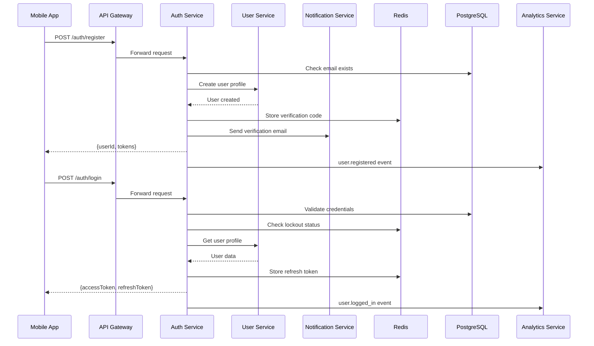

# Спецификация Auth Service

**Версия:** 1.0
**Дата:** 12 марта 2026 г.
**Статус:** Готово к разработке

---

## 1. Архитектура сервиса

### 1.1. Обзор и зона ответственности

**Auth Service** — это микросервис, отвечающий за аутентификацию, авторизацию и управление сессиями пользователей платформы StreetEye.

**Входит в зону ответственности:**
- ✅ Регистрация новых пользователей с email верификацией
- ✅ Аутентификация (login/logout)
- ✅ Выдача и валидация JWT токенов
- ✅ Refresh token ротация
- ✅ Восстановление доступа через email
- ✅ Двухфакторная аутентификация (2FA) для Premium+
- ✅ Управление активными сессиями
- ✅ Блокировка подозрительных сессий
- ✅ Rate limiting и защита от brute force

**НЕ входит в зону ответственности:**
- ❌ Управление профилями пользователей (User Service)
- ❌ Подписки и тарифы (User Service)
- ❌ Хранение пользовательских данных (User Service)
- ❌ Отправка email (Notification Service)
- ❌ Логирование аналитики (Analytics Service)

### 1.2. Взаимодействие с другими сервисами



**Таблица взаимодействий:**

| Сервис | Направление | Тип | Описание |
|--------|-------------|-----|----------|
| **User Service** | Auth → User | REST (sync) | Создание профиля при регистрации, получение данных |
| **Notification Service** | Auth → Notification | REST (async) | Отправка email верификации и восстановления |
| **Analytics Service** | Auth → Analytics | Via MQ | События аутентификации |
| **Redis** | Auth ↔ Redis | Native | Токены, rate limiting, verification codes |
| **PostgreSQL** | Auth ↔ DB | TypeORM | Хранение учётных данных, сессий |

### 1.3. Внутренняя структура модулей

```
auth-service/
├── src/
│   ├── main.ts                          # Точка входа
│   ├── app.module.ts                    # Главный модуль
│   ├── config/                          # Конфигурация
│   │   ├── database.config.ts
│   │   ├── redis.config.ts
│   │   ├── jwt.config.ts
│   │   └── rabbitmq.config.ts
│   ├── auth/                            # Основной модуль
│   │   ├── auth.module.ts
│   │   ├── controllers/
│   │   │   ├── auth.controller.ts
│   │   │   └── admin.controller.ts
│   │   ├── services/
│   │   │   ├── auth.service.ts
│   │   │   ├── jwt.service.ts
│   │   │   ├── refresh-token.service.ts
│   │   │   ├── email-verification.service.ts
│   │   │   ├── password-reset.service.ts
│   │   │   ├── two-factor.service.ts
│   │   │   └── session.service.ts
│   │   ├── repositories/
│   │   │   ├── auth.repository.ts
│   │   │   └── session.repository.ts
│   │   ├── dto/
│   │   │   ├── register.dto.ts
│   │   │   ├── login.dto.ts
│   │   │   ├── refresh-token.dto.ts
│   │   │   ├── email-verification.dto.ts
│   │   │   ├── password-reset.dto.ts
│   │   │   └── two-factor.dto.ts
│   │   ├── entities/
│   │   │   ├── auth-token.entity.ts
│   │   │   ├── email-verification.entity.ts
│   │   │   ├── password-reset.entity.ts
│   │   │   ├── user-session.entity.ts
│   │   │   └── two-factor-secret.entity.ts
│   │   └── strategies/
│   │       └── jwt.strategy.ts
│   ├── shared/                          # Общие модули
│   │   ├── guards/
│   │   │   ├── jwt-auth.guard.ts
│   │   │   └── roles.guard.ts
│   │   ├── decorators/
│   │   │   ├── auth.decorator.ts
│   │   │   └── roles.decorator.ts
│   │   ├── filters/
│   │   │   └── auth-exceptions.filter.ts
│   │   └── interceptors/
│   │       └── logging.interceptor.ts
│   └── events/                          # События
│       └── auth.events.ts
```

---

## 2. API спецификация

### 2.1. Основные endpoints аутентификации

#### POST /api/v1/auth/register

Регистрация нового пользователя с автоматической отправкой email верификации.

```
METHOD: POST
Path: /api/v1/auth/register
Auth: none

Request Body:
{
  email: string (email format, max: 255),
  password: string (min: 8, max: 128, must contain: uppercase, lowercase, number, special char),
  language: 'ru' | 'en' (default: 'ru')
}

Response: 201 Created
{
  userId: string (UUID),
  email: string,
  accessToken: string (JWT),
  refreshToken: string (UUID),
  requiresEmailVerification: boolean,
  message: string
}

Errors:
- 400 BAD_REQUEST: INVALID_EMAIL, WEAK_PASSWORD, INVALID_LANGUAGE
- 409 CONFLICT: EMAIL_EXISTS
- 429 TOO_MANY_REQUESTS: RATE_LIMIT_EXCEEDED

Rate limit: 5 запросов в минуту
```

**Пример запроса:**
```json
{
  "email": "photographer@example.com",
  "password": "Str0ng!Passw0rd",
  "language": "ru"
}
```

**Пример ответа:**
```json
{
  "userId": "550e8400-e29b-41d4-a716-446655440000",
  "email": "photographer@example.com",
  "accessToken": "eyJhbGciOiJIUzI1NiIsInR5cCI6IkpXVCJ9...",
  "refreshToken": "d8f3a7b2-1c4e-4f5a-8b9c-0d1e2f3a4b5c",
  "requiresEmailVerification": true,
  "message": "Registration successful. Please verify your email."
}
```

---

#### POST /api/v1/auth/login

Аутентификация пользователя по email и паролю.

```
METHOD: POST
Path: /api/v1/auth/login
Auth: none

Request Body:
{
  email: string (email format),
  password: string,
  twoFactorCode?: string (6 digits, required if 2FA enabled)
}

Response: 200 OK
{
  userId: string (UUID),
  email: string,
  accessToken: string (JWT),
  refreshToken: string (UUID),
  requiresTwoFactor: boolean,
  twoFactorMethod?: 'totp' | 'email',
  isEmailVerified: boolean
}

Errors:
- 400 BAD_REQUEST: INVALID_EMAIL, INVALID_TWO_FACTOR_CODE
- 401 UNAUTHORIZED: INVALID_CREDENTIALS, EMAIL_NOT_VERIFIED, ACCOUNT_LOCKED
- 403 FORBIDDEN: TWO_FACTOR_REQUIRED
- 429 TOO_MANY_REQUESTS: RATE_LIMIT_EXCEEDED

Rate limit: 10 запросов в минуту
```

**Пример запроса:**
```json
{
  "email": "photographer@example.com",
  "password": "Str0ng!Passw0rd"
}
```

**Пример ответа:**
```json
{
  "userId": "550e8400-e29b-41d4-a716-446655440000",
  "email": "photographer@example.com",
  "accessToken": "eyJhbGciOiJIUzI1NiIsInR5cCI6IkpXVCJ9...",
  "refreshToken": "d8f3a7b2-1c4e-4f5a-8b9c-0d1e2f3a4b5c",
  "requiresTwoFactor": false,
  "isEmailVerified": true
}
```

---

#### POST /api/v1/auth/logout

Выход пользователя с отзывом refresh токена.

```
METHOD: POST
Path: /api/v1/auth/logout
Auth: required (Bearer token)

Request Body:
{
  refreshToken: string (UUID),
  allSessions?: boolean (default: false)
}

Response: 200 OK
{
  success: boolean,
  message: string
}

Errors:
- 400 BAD_REQUEST: INVALID_TOKEN
- 401 UNAUTHORIZED: UNAUTHORIZED
- 404 NOT_FOUND: TOKEN_NOT_FOUND

Rate limit: 10 запросов в минуту
```

**Пример ответа:**
```json
{
  "success": true,
  "message": "Successfully logged out"
}
```

---

#### POST /api/v1/auth/refresh

Обновление access токена с использованием refresh токена (с ротацией).

```
METHOD: POST
Path: /api/v1/auth/refresh
Auth: none (refresh token в httpOnly cookie)

Request Body:
{
  refreshToken: string (UUID)
}

Response: 200 OK
{
  accessToken: string (JWT),
  refreshToken: string (UUID - новый токен)
}

Errors:
- 400 BAD_REQUEST: INVALID_TOKEN
- 401 UNAUTHORIZED: TOKEN_EXPIRED, TOKEN_REVOKED
- 409 CONFLICT: TOKEN_REUSE_DETECTED (все сессии отозваны)

Rate limit: 30 запросов в минуту
```

**Пример ответа:**
```json
{
  "accessToken": "eyJhbGciOiJIUzI1NiIsInR5cCI6IkpXVCJ9...",
  "refreshToken": "a1b2c3d4-5e6f-7a8b-9c0d-1e2f3a4b5c6d"
}
```

---

#### POST /api/v1/auth/verify-email

Подтверждение email адреса кодом верификации.

```
METHOD: POST
Path: /api/v1/auth/verify-email
Auth: none

Request Body:
{
  email: string (email format),
  verificationCode: string (6 digits)
}

Response: 200 OK
{
  success: boolean,
  message: string,
  emailVerified: boolean
}

Errors:
- 400 BAD_REQUEST: INVALID_EMAIL, INVALID_CODE
- 404 NOT_FOUND: VERIFICATION_NOT_FOUND
- 410 GONE: CODE_EXPIRED
- 429 TOO_MANY_REQUESTS: RATE_LIMIT_EXCEEDED

Rate limit: 5 запросов в минуту
```

**Пример ответа:**
```json
{
  "success": true,
  "message": "Email successfully verified",
  "emailVerified": true
}
```

---

#### POST /api/v1/auth/resend-verification

Повторная отправка кода верификации email.

```
METHOD: POST
Path: /api/v1/auth/resend-verification
Auth: none

Request Body:
{
  email: string (email format)
}

Response: 200 OK
{
  success: boolean,
  message: string,
  nextResendAt: string (ISO 8601)
}

Errors:
- 400 BAD_REQUEST: INVALID_EMAIL
- 404 NOT_FOUND: USER_NOT_FOUND
- 409 CONFLICT: EMAIL_ALREADY_VERIFIED
- 429 TOO_MANY_REQUESTS: RATE_LIMIT_EXCEEDED

Rate limit: 3 запроса в час
```

**Пример ответа:**
```json
{
  "success": true,
  "message": "Verification code sent",
  "nextResendAt": "2024-03-12T20:35:00.000Z"
}
```

---

### 2.2. Восстановление доступа

#### POST /api/v1/auth/password/reset-request

Запрос на сброс пароля (отправка email с токеном).

```
METHOD: POST
Path: /api/v1/auth/password/reset-request
Auth: none

Request Body:
{
  email: string (email format)
}

Response: 200 OK
{
  success: boolean,
  message: string
}

Errors:
- 400 BAD_REQUEST: INVALID_EMAIL
- 429 TOO_MANY_REQUESTS: RATE_LIMIT_EXCEEDED

Rate limit: 3 запроса в час
```

**Пример ответа:**
```json
{
  "success": true,
  "message": "If the email exists, a password reset link has been sent"
}
```

---

#### POST /api/v1/auth/password/reset

Установка нового пароля с использованием токена сброса.

```
METHOD: POST
Path: /api/v1/auth/password/reset
Auth: none

Request Body:
{
  token: string (UUID),
  password: string (min: 8, max: 128, complexity requirements)
}

Response: 200 OK
{
  success: boolean,
  message: string
}

Errors:
- 400 BAD_REQUEST: INVALID_TOKEN, WEAK_PASSWORD
- 404 NOT_FOUND: RESET_TOKEN_NOT_FOUND
- 410 GONE: TOKEN_EXPIRED
- 429 TOO_MANY_REQUESTS: RATE_LIMIT_EXCEEDED

Rate limit: 5 запросов в час
```

**Пример ответа:**
```json
{
  "success": true,
  "message": "Password successfully reset. Please login with new credentials."
}
```

---

### 2.3. Двухфакторная аутентификация (2FA)

#### POST /api/v1/auth/2fa/enable

Включение двухфакторной аутентификации.

```
METHOD: POST
Path: /api/v1/auth/2fa/enable
Auth: required (Premium+ users only)

Request Body:
{
  method: 'totp' | 'email' (default: 'totp')
}

Response: 200 OK
{
  success: boolean,
  method: string,
  totpSecret?: string (base32, only for TOTP),
  totpQrCode?: string (data URL, only for TOTP),
  backupCodes?: string[] (10 codes, only for TOTP),
  message: string
}

Errors:
- 400 BAD_REQUEST: INVALID_METHOD
- 401 UNAUTHORIZED: UNAUTHORIZED
- 403 FORBIDDEN: PREMIUM_REQUIRED
- 409 CONFLICT: 2FA_ALREADY_ENABLED

Rate limit: 5 запросов в минуту
```

**Пример ответа (TOTP):**
```json
{
  "success": true,
  "method": "totp",
  "totpSecret": "JBSWY3DPEHPK3PXP",
  "totpQrCode": "data:image/png;base64,iVBORw0KGgoAAAANS...",
  "backupCodes": [
    "12345678",
    "87654321",
    "11223344",
    "44332211",
    "56781234",
    "43218765",
    "13572468",
    "86429753",
    "14725836",
    "63852741"
  ],
  "message": "Scan QR code with authenticator app and verify with code"
}
```

---

#### POST /api/v1/auth/2fa/verify

Подтверждение кода 2FA (для верификации при включении или для входа).

```
METHOD: POST
Path: /api/v1/auth/2fa/verify
Auth: required (для верификации при включении) | none (для входа)

Request Body:
{
  code: string (6 digits),
  purpose: 'enable' | 'login' | 'disable'
}

Response: 200 OK
{
  success: boolean,
  message: string
}

Errors:
- 400 BAD_REQUEST: INVALID_CODE, INVALID_PURPOSE
- 401 UNAUTHORIZED: UNAUTHORIZED
- 404 NOT_FOUND: 2FA_NOT_ENABLED
- 410 GONE: CODE_EXPIRED

Rate limit: 10 запросов в минуту
```

**Пример ответа:**
```json
{
  "success": true,
  "message": "2FA successfully enabled"
}
```

---

#### POST /api/v1/auth/2fa/disable

Отключение двухфакторной аутентификации.

```
METHOD: POST
Path: /api/v1/auth/2fa/disable
Auth: required

Request Body:
{
  code: string (6 digits)
}

Response: 200 OK
{
  success: boolean,
  message: string
}

Errors:
- 400 BAD_REQUEST: INVALID_CODE
- 401 UNAUTHORIZED: UNAUTHORIZED
- 404 NOT_FOUND: 2FA_NOT_ENABLED

Rate limit: 5 запросов в минуту
```

---

### 2.4. Управление сессиями

#### GET /api/v1/auth/sessions

Получение списка активных сессий пользователя.

```
METHOD: GET
Path: /api/v1/auth/sessions
Auth: required (Bearer token)

Response: 200 OK
{
  sessions: [{
    id: string (UUID),
    device: string,
    os: string,
    browser: string,
    ip: string (masked),
    location: {
      country: string,
      city: string
    },
    createdAt: string (ISO 8601),
    lastActiveAt: string (ISO 8601),
    isCurrent: boolean
  }],
  total: number
}

Errors:
- 401 UNAUTHORIZED: UNAUTHORIZED

Rate limit: 30 запросов в минуту
```

**Пример ответа:**
```json
{
  "sessions": [
    {
      "id": "550e8400-e29b-41d4-a716-446655440000",
      "device": "iPhone 15 Pro",
      "os": "iOS 17.2",
      "browser": "Safari",
      "ip": "192.168.***.***",
      "location": {
        "country": "Ukraine",
        "city": "Kyiv"
      },
      "createdAt": "2024-03-10T14:30:00.000Z",
      "lastActiveAt": "2024-03-12T19:45:00.000Z",
      "isCurrent": true
    },
    {
      "id": "660e8400-e29b-41d4-a716-446655440001",
      "device": "MacBook Pro",
      "os": "macOS 14.2",
      "browser": "Chrome 120",
      "ip": "192.168.***.***",
      "location": {
        "country": "Ukraine",
        "city": "Kyiv"
      },
      "createdAt": "2024-03-08T10:00:00.000Z",
      "lastActiveAt": "2024-03-11T22:15:00.000Z",
      "isCurrent": false
    }
  ],
  "total": 2
}
```

---

#### DELETE /api/v1/auth/sessions/:sessionId

Завершение конкретной сессии.

```
METHOD: DELETE
Path: /api/v1/auth/sessions/:sessionId
Auth: required (Bearer token)

Response: 200 OK
{
  success: boolean,
  message: string
}

Errors:
- 401 UNAUTHORIZED: UNAUTHORIZED
- 404 NOT_FOUND: SESSION_NOT_FOUND

Rate limit: 10 запросов в минуту
```

---

#### DELETE /api/v1/auth/sessions/all

Завершение всех сессий кроме текущей.

```
METHOD: DELETE
Path: /api/v1/auth/sessions/all
Auth: required (Bearer token)

Response: 200 OK
{
  success: boolean,
  message: string,
  terminatedSessions: number
}

Errors:
- 401 UNAUTHORIZED: UNAUTHORIZED

Rate limit: 5 запросов в минуту
```

**Пример ответа:**
```json
{
  "success": true,
  "message": "All other sessions terminated",
  "terminatedSessions": 2
}
```

---

### 2.5. Admin endpoints

#### POST /api/v1/admin/users/:userId/block

Блокировка пользователя (admin only).

```
METHOD: POST
Path: /api/v1/admin/users/:userId/block
Auth: required (admin role)

Request Body:
{
  reason: string (max: 500),
  duration?: number (minutes, null = permanent)
}

Response: 200 OK
{
  success: boolean,
  message: string,
  blockedUntil?: string (ISO 8601, null if permanent)
}

Errors:
- 400 BAD_REQUEST: INVALID_DURATION
- 401 UNAUTHORIZED: UNAUTHORIZED
- 403 FORBIDDEN: ADMIN_REQUIRED
- 404 NOT_FOUND: USER_NOT_FOUND

Rate limit: 10 запросов в минуту
```

---

#### POST /api/v1/admin/users/:userId/unblock

Разблокировка пользователя (admin only).

```
METHOD: POST
Path: /api/v1/admin/users/:userId/unblock
Auth: required (admin role)

Response: 200 OK
{
  success: boolean,
  message: string
}

Errors:
- 401 UNAUTHORIZED: UNAUTHORIZED
- 403 FORBIDDEN: ADMIN_REQUIRED
- 404 NOT_FOUND: USER_NOT_FOUND

Rate limit: 10 запросов в минуту
```

---

## 3. Схема базы данных

### 3.1. Таблицы сервиса

#### auth_tokens

Хранение refresh токенов и blacklist для отозванных токенов.

```sql
CREATE TABLE auth_tokens (
    id UUID PRIMARY KEY DEFAULT gen_random_uuid(),
    user_id UUID NOT NULL,
    token_hash VARCHAR(255) NOT NULL,
    type VARCHAR(20) NOT NULL CHECK (type IN ('refresh', 'blacklisted')),
    device_info JSONB,
    ip_address INET,
    expires_at TIMESTAMP WITH TIME ZONE NOT NULL,
    created_at TIMESTAMP WITH TIME ZONE DEFAULT NOW(),
    revoked_at TIMESTAMP WITH TIME ZONE,
    replaced_by UUID REFERENCES auth_tokens(id)
);

-- Индексы
CREATE INDEX idx_auth_tokens_user_id ON auth_tokens(user_id);
CREATE INDEX idx_auth_tokens_token_hash ON auth_tokens(token_hash);
CREATE INDEX idx_auth_tokens_expires_at ON auth_tokens(expires_at);
CREATE INDEX idx_auth_tokens_type ON auth_tokens(type);
CREATE UNIQUE INDEX idx_auth_tokens_active_per_user 
ON auth_tokens(user_id, type) 
WHERE type = 'refresh' AND revoked_at IS NULL;

-- Очистка старых токенов (автоматически)
CREATE INDEX idx_auth_tokens_cleanup ON auth_tokens(expires_at) 
WHERE expires_at < NOW();
```

| Поле | Тип | Описание |
|------|-----|----------|
| id | UUID | Первичный ключ |
| user_id | UUID | Foreign key к users (в User Service) |
| token_hash | VARCHAR(255) | Хэш refresh токена (SHA-256) |
| type | VARCHAR(20) | Тип: refresh/blacklisted |
| device_info | JSONB | Информация об устройстве |
| ip_address | INET | IP адрес создания сессии |
| expires_at | TIMESTAMP | Время истечения токена |
| created_at | TIMESTAMP | Дата создания |
| revoked_at | TIMESTAMP | Дата отзыва (null = активен) |
| replaced_by | UUID | Ссылка на новый токен (ротация) |

---

#### email_verifications

Коды подтверждения email для новых пользователей.

```sql
CREATE TABLE email_verifications (
    id UUID PRIMARY KEY DEFAULT gen_random_uuid(),
    user_id UUID NOT NULL,
    email VARCHAR(255) NOT NULL,
    code_hash VARCHAR(255) NOT NULL,
    attempts INT DEFAULT 0,
    max_attempts INT DEFAULT 3,
    verified BOOLEAN DEFAULT false,
    created_at TIMESTAMP WITH TIME ZONE DEFAULT NOW(),
    expires_at TIMESTAMP WITH TIME ZONE NOT NULL
);

-- Индексы
CREATE INDEX idx_email_verifications_user_id ON email_verifications(user_id);
CREATE INDEX idx_email_verifications_email ON email_verifications(email);
CREATE INDEX idx_email_verifications_expires_at ON email_verifications(expires_at);
CREATE INDEX idx_email_verifications_cleanup 
ON email_verifications(expires_at) 
WHERE expires_at < NOW();
```

| Поле | Тип | Описание |
|------|-----|----------|
| id | UUID | Первичный ключ |
| user_id | UUID | Foreign key к users |
| email | VARCHAR(255) | Email для верификации |
| code_hash | VARCHAR(255) | Хэш кода верификации (SHA-256) |
| attempts | INT | Количество попыток ввода |
| max_attempts | INT | Максимум попыток (3) |
| verified | BOOLEAN | Флаг успешной верификации |
| created_at | TIMESTAMP | Дата создания |
| expires_at | TIMESTAMP | Время истечения (24 часа) |

---

#### password_reset_tokens

Токены для сброса пароля.

```sql
CREATE TABLE password_reset_tokens (
    id UUID PRIMARY KEY DEFAULT gen_random_uuid(),
    user_id UUID NOT NULL,
    token_hash VARCHAR(255) NOT NULL,
    used BOOLEAN DEFAULT false,
    created_at TIMESTAMP WITH TIME ZONE DEFAULT NOW(),
    expires_at TIMESTAMP WITH TIME ZONE NOT NULL
);

-- Индексы
CREATE INDEX idx_password_reset_tokens_user_id ON password_reset_tokens(user_id);
CREATE INDEX idx_password_reset_tokens_token_hash ON password_reset_tokens(token_hash);
CREATE INDEX idx_password_reset_tokens_expires_at ON password_reset_tokens(expires_at);
CREATE INDEX idx_password_reset_tokens_used ON password_reset_tokens(used);
```

| Поле | Тип | Описание |
|------|-----|----------|
| id | UUID | Первичный ключ |
| user_id | UUID | Foreign key к users |
| token_hash | VARCHAR(255) | Хэш токена сброса |
| used | BOOLEAN | Флаг использования |
| created_at | TIMESTAMP | Дата создания |
| expires_at | TIMESTAMP | Время истечения (1 час) |

---

#### user_sessions

Активные сессии пользователей для управления устройствами.

```sql
CREATE TABLE user_sessions (
    id UUID PRIMARY KEY DEFAULT gen_random_uuid(),
    user_id UUID NOT NULL,
    refresh_token_id UUID REFERENCES auth_tokens(id),
    device_type VARCHAR(50),
    device_model VARCHAR(100),
    os_name VARCHAR(50),
    os_version VARCHAR(50),
    browser_name VARCHAR(50),
    browser_version VARCHAR(50),
    ip_address INET,
    user_agent TEXT,
    country VARCHAR(100),
    city VARCHAR(100),
    created_at TIMESTAMP WITH TIME ZONE DEFAULT NOW(),
    last_active_at TIMESTAMP WITH TIME ZONE DEFAULT NOW(),
    expires_at TIMESTAMP WITH TIME ZONE NOT NULL
);

-- Индексы
CREATE INDEX idx_user_sessions_user_id ON user_sessions(user_id);
CREATE INDEX idx_user_sessions_refresh_token_id ON user_sessions(refresh_token_id);
CREATE INDEX idx_user_sessions_last_active ON user_sessions(last_active_at);
CREATE INDEX idx_user_sessions_expires_at ON user_sessions(expires_at);
CREATE INDEX idx_user_sessions_cleanup 
ON user_sessions(expires_at) 
WHERE expires_at < NOW();
```

| Поле | Тип | Описание |
|------|-----|----------|
| id | UUID | Первичный ключ |
| user_id | UUID | Foreign key к users |
| refresh_token_id | UUID | Связь с refresh токеном |
| device_type | VARCHAR(50) | Тип: mobile/desktop/tablet |
| device_model | VARCHAR(100) | Модель устройства |
| os_name | VARCHAR(50) | ОС: iOS/Android/Windows/macOS |
| os_version | VARCHAR(50) | Версия ОС |
| browser_name | VARCHAR(50) | Браузер |
| browser_version | VARCHAR(50) | Версия браузера |
| ip_address | INET | IP адрес |
| user_agent | TEXT | User agent строка |
| country | VARCHAR(100) | Страна (по IP) |
| city | VARCHAR(100) | Город (по IP) |
| created_at | TIMESTAMP | Дата создания сессии |
| last_active_at | TIMESTAMP | Последняя активность |
| expires_at | TIMESTAMP | Время истечения сессии |

---

#### two_factor_secrets

Секреты и настройки двухфакторной аутентификации.

```sql
CREATE TABLE two_factor_secrets (
    id UUID PRIMARY KEY DEFAULT gen_random_uuid(),
    user_id UUID NOT NULL UNIQUE,
    method VARCHAR(20) NOT NULL CHECK (method IN ('totp', 'email')),
    totp_secret VARCHAR(255),
    totp_backup_codes TEXT[],
    totp_backup_codes_used TEXT[] DEFAULT '{}',
    enabled BOOLEAN DEFAULT false,
    enabled_at TIMESTAMP WITH TIME ZONE,
    created_at TIMESTAMP WITH TIME ZONE DEFAULT NOW(),
    updated_at TIMESTAMP WITH TIME ZONE DEFAULT NOW()
);

-- Индексы
CREATE INDEX idx_two_factor_secrets_user_id ON two_factor_secrets(user_id);
CREATE INDEX idx_two_factor_secrets_enabled ON two_factor_secrets(enabled);
```

| Поле | Тип | Описание |
|------|-----|----------|
| id | UUID | Первичный ключ |
| user_id | UUID | Foreign key к users (UNIQUE) |
| method | VARCHAR(20) | Метод: totp/email |
| totp_secret | VARCHAR(255) | Секрет TOTP (base32) |
| totp_backup_codes | TEXT[] | Массив backup кодов (10 шт) |
| totp_backup_codes_used | TEXT[] | Использованные backup коды |
| enabled | BOOLEAN | Флаг включения 2FA |
| enabled_at | TIMESTAMP | Дата включения |
| created_at | TIMESTAMP | Дата создания |
| updated_at | TIMESTAMP | Дата обновления |

---

#### login_attempts

Попытки входа для защиты от brute force и автоматических блокировок.

```sql
CREATE TABLE login_attempts (
    id UUID PRIMARY KEY DEFAULT gen_random_uuid(),
    email VARCHAR(255) NOT NULL,
    ip_address INET NOT NULL,
    success BOOLEAN DEFAULT false,
    failure_reason VARCHAR(50),
    created_at TIMESTAMP WITH TIME ZONE DEFAULT NOW()
);

-- Индексы
CREATE INDEX idx_login_attempts_email ON login_attempts(email);
CREATE INDEX idx_login_attempts_ip_address ON login_attempts(ip_address);
CREATE INDEX idx_login_attempts_created_at ON login_attempts(created_at);
CREATE INDEX idx_login_attempts_recent 
ON login_attempts(email, ip_address, created_at) 
WHERE created_at > NOW() - INTERVAL '15 minutes';

-- Представление для подсчёта неудачных попыток
CREATE VIEW recent_failed_attempts AS
SELECT 
    email,
    ip_address,
    COUNT(*) as attempt_count,
    MIN(created_at) as first_attempt,
    MAX(created_at) as last_attempt
FROM login_attempts
WHERE success = false 
  AND created_at > NOW() - INTERVAL '15 minutes'
GROUP BY email, ip_address;
```

| Поле | Тип | Описание |
|------|-----|----------|
| id | UUID | Первичный ключ |
| email | VARCHAR(255) | Email попытки входа |
| ip_address | INET | IP адрес |
| success | BOOLEAN | Успешность попытки |
| failure_reason | VARCHAR(50) | Причина неудачи |
| created_at | TIMESTAMP | Дата попытки |

---

#### account_lockouts

Активные блокировки аккаунтов после множественных неудачных попыток.

```sql
CREATE TABLE account_lockouts (
    id UUID PRIMARY KEY DEFAULT gen_random_uuid(),
    email VARCHAR(255) NOT NULL,
    ip_address INET,
    reason VARCHAR(100) NOT NULL,
    locked_until TIMESTAMP WITH TIME ZONE NOT NULL,
    created_at TIMESTAMP WITH TIME ZONE DEFAULT NOW(),
    released_at TIMESTAMP WITH TIME ZONE
);

-- Индексы
CREATE INDEX idx_account_lockouts_email ON account_lockouts(email);
CREATE INDEX idx_account_lockouts_ip_address ON account_lockouts(ip_address);
CREATE INDEX idx_account_lockouts_locked_until ON account_lockouts(locked_until);
CREATE INDEX idx_account_lockouts_active 
ON account_lockouts(email, locked_until) 
WHERE released_at IS NULL AND locked_until > NOW();
```

| Поле | Тип | Описание |
|------|-----|----------|
| id | UUID | Первичный ключ |
| email | VARCHAR(255) | Email заблокированного аккаунта |
| ip_address | INET | IP адрес (для блокировок по IP) |
| reason | VARCHAR(100) | Причина блокировки |
| locked_until | TIMESTAMP | Время разблокировки |
| created_at | TIMESTAMP | Дата блокировки |
| released_at | TIMESTAMP | Дата снятия блокировки |

---

## 4. Детали реализации

### 4.1. JWT стратегия

**Формат токенов:**

```typescript
// Access Token (15 минут)
interface AccessTokenPayload {
  sub: string;          // user_id
  email: string;
  type: 'access';
  iat: number;          // issued at
  exp: number;          // expiration (iat + 900)
  iss: 'streetEye';     // issuer
  aud: 'streetEye-app'; // audience
}

// Refresh Token (7 дней, хранится в БД и Redis)
interface RefreshTokenPayload {
  sub: string;          // user_id
  type: 'refresh';
  tokenId: string;      // ссылка на запись в БД
  iat: number;
  exp: number;          // iat + 604800 (7 дней)
  iss: 'streetEye';
  aud: 'streetEye-app';
}
```

**Механизм ротации refresh токенов:**

```typescript
class RefreshTokenService {
  async rotateRefreshToken(oldRefreshToken: string): Promise<TokenPair> {
    // 1. Найти старый токен в БД
    const oldToken = await this.findToken(oldRefreshToken);
    
    if (!oldToken) {
      throw new TokenNotFoundException();
    }
    
    // 2. Проверить, не был ли токен уже использован
    if (oldToken.revoked_at) {
      // Token reuse detected - отозвать все сессии!
      await this.revokeAllUserSessions(oldToken.user_id);
      throw new TokenReuseDetectedException();
    }
    
    // 3. Создать новый токен
    const newToken = await this.createToken(oldToken.user_id);
    
    // 4. Отозвать старый токен с ссылкой на новый
    await this.revokeToken(oldToken.id, newToken.id);
    
    // 5. Добавить старый токен в blacklist
    await this.addToBlacklist(oldToken.token_hash);
    
    return {
      accessToken: this.generateAccessToken(oldToken.user_id),
      refreshToken: newToken.token
    };
  }
}
```

**Blacklist для отозванных токенов:**

```typescript
// Redis structure
Key: auth:blacklist:{token_hash}
Value: "revoked"
TTL: до истечения original expiration токена

// Проверка при валидации
async validateToken(token: string): Promise<boolean> {
  const tokenHash = this.hash(token);
  const isBlacklisted = await this.redis.get(`auth:blacklist:${tokenHash}`);
  
  if (isBlacklisted) {
    throw new TokenRevokedException();
  }
  
  return this.jwt.verify(token);
}
```

---

### 4.2. Хэширование паролей

**Алгоритм:** bcrypt с cost factor 12

```typescript
import * as bcrypt from 'bcrypt';

const SALT_ROUNDS = 12;

async function hashPassword(password: string): Promise<string> {
  return bcrypt.hash(password, SALT_ROUNDS);
}

async function verifyPassword(
  password: string,
  hash: string
): Promise<boolean> {
  return bcrypt.compare(password, hash);
}
```

**Требования к паролям:**

```typescript
const PASSWORD_REGEX = {
  minLength: 8,
  maxLength: 128,
  requiresUppercase: /[A-Z]/,
  requiresLowercase: /[a-z]/,
  requiresNumber: /[0-9]/,
  requiresSpecial: /[!@#$%^&*()_+\-=\[\]{};':"\\|,.<>\/?]/
};

function validatePassword(password: string): ValidationResult {
  if (password.length < PASSWORD_REGEX.minLength) {
    return { valid: false, error: 'WEAK_PASSWORD_TOO_SHORT' };
  }
  
  if (password.length > PASSWORD_REGEX.maxLength) {
    return { valid: false, error: 'PASSWORD_TOO_LONG' };
  }
  
  if (!PASSWORD_REGEX.requiresUppercase.test(password)) {
    return { valid: false, error: 'PASSWORD_REQUIRES_UPPERCASE' };
  }
  
  if (!PASSWORD_REGEX.requiresLowercase.test(password)) {
    return { valid: false, error: 'PASSWORD_REQUIRES_LOWERCASE' };
  }
  
  if (!PASSWORD_REGEX.requiresNumber.test(password)) {
    return { valid: false, error: 'PASSWORD_REQUIRES_NUMBER' };
  }
  
  if (!PASSWORD_REGEX.requiresSpecial.test(password)) {
    return { valid: false, error: 'PASSWORD_REQUIRES_SPECIAL_CHAR' };
  }
  
  // Проверка на распространённые пароли
  if (isCommonPassword(password)) {
    return { valid: false, error: 'PASSWORD_TOO_COMMON' };
  }
  
  return { valid: true };
}
```

---

### 4.3. Email верификация

**Генерация кодов подтверждения:**

```typescript
import { randomInt } from 'crypto';

class EmailVerificationService {
  private readonly CODE_LENGTH = 6;
  private readonly CODE_TTL_HOURS = 24;
  private readonly MAX_ATTEMPTS = 3;
  
  async createVerification(userId: string, email: string): Promise<void> {
    // Генерация 6-значного кода
    const code = Array.from({ length: this.CODE_LENGTH }, () => 
      randomInt(0, 10).toString()
    ).join('');
    
    const codeHash = this.hash(code);
    const expiresAt = new Date(Date.now() + this.CODE_TTL_HOURS * 3600000);
    
    // Сохранение в БД
    await this.authRepository.createEmailVerification({
      user_id: userId,
      email,
      code_hash: codeHash,
      expires_at: expiresAt,
      max_attempts: this.MAX_ATTEMPTS
    });
    
    // Отправка email
    await this.notificationService.sendEmailVerification({
      to: email,
      code,
      expiresAt
    });
  }
  
  async verifyCode(email: string, code: string): Promise<boolean> {
    const verification = await this.findVerification(email);
    
    if (!verification) {
      throw new VerificationNotFoundException();
    }
    
    if (verification.expires_at < new Date()) {
      throw new CodeExpiredException();
    }
    
    if (verification.attempts >= verification.max_attempts) {
      throw new MaxAttemptsExceededException();
    }
    
    const codeHash = this.hash(code);
    const isValid = codeHash === verification.code_hash;
    
    if (!isValid) {
      await this.incrementAttempts(verification.id);
      throw new InvalidCodeException();
    }
    
    await this.markAsVerified(verification.id);
    return true;
  }
}
```

---

### 4.4. 2FA реализация

**Алгоритм:** TOTP (RFC 6238)

```typescript
import { authenticator } from 'otplib';

class TwoFactorService {
  private readonly ISSUER = 'streetEye';
  private readonly BACKUP_CODES_COUNT = 10;
  private readonly BACKUP_CODES_LENGTH = 8;
  
  generateTotpSecret(userId: string, email: string): TotpSetup {
    const secret = authenticator.generateSecret();
    const uri = authenticator.keyuri(email, this.ISSUER, secret);
    
    // Генерация backup кодов
    const backupCodes = Array.from(
      { length: this.BACKUP_CODES_COUNT },
      () => this.generateBackupCode()
    );
    
    return {
      secret,
      qrCodeUrl: uri, // data:image/png;base64,...
      backupCodes
    };
  }
  
  verifyTotpCode(secret: string, code: string): boolean {
    return authenticator.verify({
      token: code,
      secret,
      window: 1 // ±1 период (30 секунд)
    });
  }
  
  private generateBackupCode(): string {
    return Array.from({ length: this.BACKUP_CODES_LENGTH }, () => 
      randomInt(0, 10).toString()
    ).join('');
  }
}
```

**Backup коды:**

```typescript
// Хранение backup кодов (только хэши!)
interface TwoFactorSecret {
  totp_backup_codes: string[];        // Хэши кодов
  totp_backup_codes_used: string[];   // Использованные хэши
}

async function useBackupCode(
  userId: string,
  code: string
): Promise<boolean> {
  const secret = await this.getTwoFactorSecret(userId);
  const codeHash = this.hash(code);
  
  // Проверка, не был ли код уже использован
  if (secret.totp_backup_codes_used.includes(codeHash)) {
    throw new BackupCodeAlreadyUsedException();
  }
  
  // Проверка валидности
  const isValid = secret.totp_backup_codes.includes(codeHash);
  if (!isValid) {
    throw new InvalidBackupCodeException();
  }
  
  // Пометить как использованный
  await this.markBackupCodeAsUsed(userId, codeHash);
  
  return true;
}
```

---

### 4.5. Rate limiting и блокировки

**Стратегия:** Sliding window log в Redis

```typescript
class RateLimitService {
  private readonly WINDOW_MS = 60000; // 1 минута
  
  async checkLimit(key: string, limit: number): Promise<RateLimitResult> {
    const now = Date.now();
    const windowStart = now - this.WINDOW_MS;
    
    // Redis pipeline для атомарности
    const pipeline = this.redis.pipeline();
    pipeline.zremrangebyscore(key, 0, windowStart);
    pipeline.zadd(key, now, `${now}-${randomUUID()}`);
    pipeline.zcard(key);
    pipeline.expire(key, Math.ceil(this.WINDOW_MS / 1000));
    
    const results = await pipeline.exec();
    const requestCount = results[2][1] as number;
    
    return {
      allowed: requestCount <= limit,
      remaining: Math.max(0, limit - requestCount),
      resetAt: new Date(now + this.WINDOW_MS)
    };
  }
}

// Конкретные лимиты
const RATE_LIMITS = {
  REGISTER: { limit: 5, window: 60000 },      // 5 в минуту
  LOGIN: { limit: 10, window: 60000 },        // 10 в минуту
  REFRESH_TOKEN: { limit: 30, window: 60000 }, // 30 в минуту
  PASSWORD_RESET: { limit: 3, window: 3600000 }, // 3 в час
  VERIFY_EMAIL: { limit: 5, window: 60000 },  // 5 в минуту
  RESEND_VERIFICATION: { limit: 3, window: 3600000 } // 3 в час
};
```

**Автоматические блокировки:**

```typescript
class AccountLockoutService {
  private readonly FAILED_ATTEMPTS_THRESHOLD = 10;
  private readonly LOCKOUT_DURATION_MS = 15 * 60000; // 15 минут
  
  async recordFailedAttempt(email: string, ipAddress: string): Promise<void> {
    // Запись попытки
    await this.authRepository.createLoginAttempt({
      email,
      ip_address: ipAddress,
      success: false,
      failure_reason: 'INVALID_CREDENTIALS'
    });
    
    // Подсчёт неудачных попыток за последние 15 минут
    const failedCount = await this.countRecentFailedAttempts(email, ipAddress);
    
    if (failedCount >= this.FAILED_ATTEMPTS_THRESHOLD) {
      // Блокировка по email + IP
      await this.createLockout({
        email,
        ip_address: ipAddress,
        reason: 'BRUTE_FORCE_DETECTED',
        locked_until: new Date(Date.now() + this.LOCKOUT_DURATION_MS)
      });
      
      // Уведомление пользователя
      await this.notificationService.sendSecurityAlert({
        to: email,
        type: 'BRUTE_FORCE_ATTEMPT',
        ipAddress,
        timestamp: new Date()
      });
    }
  }
  
  async isLockedOut(email: string, ipAddress: string): Promise<boolean> {
    const lockout = await this.getActiveLockout(email, ipAddress);
    
    if (!lockout) {
      return false;
    }
    
    if (lockout.locked_until < new Date()) {
      // Блокировка истекла - автоматически снять
      await this.releaseLockout(lockout.id);
      return false;
    }
    
    return true;
  }
}
```

---

### 4.6. Безопасность

**Защита от enumeration attacks:**

```typescript
// Одинаковые сообщения для существующих и несуществующих email
async requestPasswordReset(email: string): Promise<void> {
  const user = await this.userRepository.findByEmail(email);
  
  // Всегда возвращаем успех, даже если email не найден
  // Это предотвращает перебор email адресов
  if (user) {
    await this.sendPasswordResetEmail(user);
  }
  
  return {
    success: true,
    message: 'If the email exists, a password reset link has been sent'
  };
}
```

**HTTPS only cookies:**

```typescript
// Настройка httpOnly cookie для refresh токена
res.cookie('refreshToken', refreshToken, {
  httpOnly: true,
  secure: process.env.NODE_ENV === 'production', // HTTPS only в продакшене
  sameSite: 'strict',
  maxAge: 7 * 24 * 60 * 60 * 1000, // 7 дней
  path: '/api/v1/auth/refresh'
});
```

**CORS политика:**

```typescript
// Разрешены только домены приложения
const CORS_CONFIG = {
  origin: [
    'https://streetye.com',
    'https://app.streetye.com',
    'https://admin.streetye.com'
  ],
  methods: ['GET', 'POST', 'PUT', 'DELETE', 'PATCH', 'OPTIONS'],
  allowedHeaders: ['Content-Type', 'Authorization'],
  credentials: true, // Для cookie
  maxAge: 86400 // 24 часа
};
```

**Защита от timing attacks:**

```typescript
import { timingSafeEqual } from 'crypto';

function safeCompare(a: string, b: string): boolean {
  if (a.length !== b.length) {
    return false;
  }
  
  return timingSafeEqual(
    Buffer.from(a),
    Buffer.from(b)
  );
}
```

---

## 5. Обработка ошибок и логирование

### 5.1. Коды ошибок

| Код | HTTP Status | Описание |
|-----|-------------|----------|
| **EMAIL_EXISTS** | 409 | Email уже зарегистрирован |
| **WEAK_PASSWORD** | 400 | Пароль не соответствует требованиям |
| **PASSWORD_TOO_SHORT** | 400 | Пароль слишком короткий |
| **PASSWORD_REQUIRES_UPPERCASE** | 400 | Требуется заглавная буква |
| **PASSWORD_REQUIRES_LOWERCASE** | 400 | Требуется строчная буква |
| **PASSWORD_REQUIRES_NUMBER** | 400 | Требуется цифра |
| **PASSWORD_REQUIRES_SPECIAL_CHAR** | 400 | Требуется спецсимвол |
| **PASSWORD_TOO_COMMON** | 400 | Слишком распространённый пароль |
| **INVALID_EMAIL** | 400 | Неверный формат email |
| **INVALID_CREDENTIALS** | 401 | Неверный email или пароль |
| **EMAIL_NOT_VERIFIED** | 401 | Email не подтверждён |
| **ACCOUNT_LOCKED** | 401 | Аккаунт заблокирован |
| **TWO_FACTOR_REQUIRED** | 403 | Требуется 2FA код |
| **INVALID_TWO_FACTOR_CODE** | 401 | Неверный 2FA код |
| **INVALID_TOKEN** | 401 | Неверный токен |
| **TOKEN_EXPIRED** | 401 | Токен истёк |
| **TOKEN_REVOKED** | 401 | Токен отозван |
| **TOKEN_REUSE_DETECTED** | 409 | Обнаружено повторное использование токена |
| **UNAUTHORIZED** | 401 | Пользователь не аутентифицирован |
| **FORBIDDEN** | 403 | Недостаточно прав |
| **PREMIUM_REQUIRED** | 403 | Требуется Premium подписка |
| **VERIFICATION_NOT_FOUND** | 404 | Код верификации не найден |
| **USER_NOT_FOUND** | 404 | Пользователь не найден |
| **SESSION_NOT_FOUND** | 404 | Сессия не найдена |
| **CODE_EXPIRED** | 410 | Код верификации истёк |
| **MAX_ATTEMPTS_EXCEEDED** | 429 | Превышено количество попыток |
| **RATE_LIMIT_EXCEEDED** | 429 | Превышен лимит запросов |
| **DATABASE_ERROR** | 500 | Ошибка базы данных |

---

### 5.2. Логирование

**События для логирования:**

```typescript
enum AuthLogEvents {
  // Аутентификация
  USER_REGISTERED = 'user.registered',
  USER_LOGGED_IN = 'user.logged_in',
  USER_LOGGED_OUT = 'user.logged_out',
  LOGIN_FAILED = 'user.login_failed',
  
  // Токены
  TOKEN_ISSUED = 'auth.token_issued',
  TOKEN_REFRESHED = 'auth.token_refreshed',
  TOKEN_REVOKED = 'auth.token_revoked',
  TOKEN_REUSE_DETECTED = 'auth.token_reuse_detected',
  
  // Верификация
  EMAIL_VERIFICATION_SENT = 'auth.email_verification_sent',
  EMAIL_VERIFIED = 'auth.email_verified',
  EMAIL_VERIFICATION_FAILED = 'auth.email_verification_failed',
  
  // Восстановление
  PASSWORD_RESET_REQUESTED = 'auth.password_reset_requested',
  PASSWORD_RESET_COMPLETED = 'auth.password_reset_completed',
  PASSWORD_RESET_FAILED = 'auth.password_reset_failed',
  
  // 2FA
  TWO_FACTOR_ENABLED = 'auth.two_factor_enabled',
  TWO_FACTOR_DISABLED = 'auth.two_factor_disabled',
  TWO_FACTOR_VERIFICATION_FAILED = 'auth.two_factor_verification_failed',
  
  // Безопасность
  ACCOUNT_LOCKED = 'auth.account_locked',
  ACCOUNT_UNLOCKED = 'auth.account_unlocked',
  SUSPICIOUS_ACTIVITY_DETECTED = 'auth.suspicious_activity_detected',
  SESSION_TERMINATED = 'auth.session_terminated'
}
```

**Формат логов:**

```typescript
interface AuthLogEntry {
  timestamp: string;        // ISO 8601
  event: AuthLogEvents;
  userId?: string;          // UUID (если известен)
  email?: string;           // (не логировать полный email!)
  ipAddress: string;        // (маскировать!)
  userAgent: string;
  deviceId?: string;
  sessionId?: string;
  success: boolean;
  errorCode?: string;
  metadata?: Record<string, any>;
}

// Пример (маскировка email и IP)
{
  "timestamp": "2024-03-12T19:45:00.000Z",
  "event": "user.login_failed",
  "email": "phot***@example.com",  // Маскировка
  "ipAddress": "192.168.***.***",   // Маскировка
  "userAgent": "Mozilla/5.0 (iPhone; CPU iPhone OS 17_2...)",
  "deviceId": "device-uuid",
  "success": false,
  "errorCode": "INVALID_CREDENTIALS",
  "metadata": {
    "attemptNumber": 3,
    "deviceType": "mobile"
  }
}
```

**Что НЕ логировать:**

```typescript
// ⚠️ ЗАПРЕЩЕНО ЛОГИРОВАТЬ:
- Полные email адреса (только маскированные)
- Пароли (никогда!)
- Полные токены (только хэши/ID)
- 2FA коды
- Backup коды
- Полные IP адреса (маскировать последние 2 октета)
- Credit card данные
- PII (персональные данные) без необходимости
```

---

### 5.3. Аудит

**События для аудита безопасности:**

```typescript
interface AuditEvent {
  id: string;             // UUID
  timestamp: string;      // ISO 8601
  eventType: string;
  actor: {
    userId?: string;
    email?: string;       // Маскированный
    ipAddress: string;    // Маскированный
    userAgent: string;
  };
  target: {
    resourceType: string; // 'user', 'session', 'token'
    resourceId: string;
  };
  action: string;         // 'create', 'read', 'update', 'delete'
  outcome: 'success' | 'failure';
  reason?: string;        // Для failures
  metadata: Record<string, any>;
}

// Пример аудита блокировки аккаунта
{
  "id": "audit-uuid",
  "timestamp": "2024-03-12T19:45:00.000Z",
  "eventType": "account.locked",
  "actor": {
    "userId": null,
    "email": "phot***@example.com",
    "ipAddress": "192.168.***.***",
    "userAgent": "Mozilla/5.0..."
  },
  "target": {
    "resourceType": "user",
    "resourceId": "user-uuid"
  },
  "action": "update",
  "outcome": "success",
  "reason": "BRUTE_FORCE_DETECTED",
  "metadata": {
    "failedAttempts": 10,
    "lockoutDuration": 900,
    "autoLocked": true
  }
}
```

**Хранение аудит логов:**

- **Хранилище:** Отдельная таблица в PostgreSQL или ClickHouse
- **Срок хранения:** 1 год для security events, 90 дней для обычных
- **Индексы:** По timestamp, userId, eventType
- **Доступ:** Только через admin endpoints с аудитом доступа

---

## 6. Интеграция с другими сервисами

### 6.1. User Service

**Создание пользователя при регистрации:**

```typescript
async register(dto: RegisterDto): Promise<RegistrationResult> {
  // 1. Проверка email на существование
  const existingUser = await this.userRepository.findByEmail(dto.email);
  if (existingUser) {
    throw new EmailExistsException();
  }
  
  // 2. Хэширование пароля
  const passwordHash = await this.hashPassword(dto.password);
  
  // 3. Создание пользователя в User Service
  const user = await this.userClient.create({
    email: dto.email,
    passwordHash,
    language: dto.language
  });
  
  // 4. Генерация токенов
  const tokens = await this.generateTokens(user.id);
  
  // 5. Отправка email верификации
  await this.emailVerificationService.send(user.id, dto.email);
  
  // 6. Событие для аналитики
  await this.analyticsService.publish('user.registered', {
    userId: user.id,
    email: dto.email,
    timestamp: new Date()
  });
  
  return {
    userId: user.id,
    ...tokens,
    requiresEmailVerification: true
  };
}
```

### 6.2. Notification Service

**Отправка email верификации:**

```typescript
async sendVerificationEmail(email: string, code: string): Promise<void> {
  await this.notificationClient.sendEmail({
    to: email,
    template: 'email-verification',
    subject: 'Подтвердите ваш email - StreetEye',
    data: {
      code,
      expiresAt: new Date(Date.now() + 24 * 3600000),
      supportEmail: 'support@streetye.com'
    }
  });
}
```

### 6.3. Analytics Service

**Публикация событий:**

```typescript
async publishAuthEvent(event: AuthEvent): Promise<void> {
  await this.rabbitMQService.publish({
    exchange: 'streetEye',
    routingKey: `auth.${event.type}`,
    data: {
      eventId: randomUUID(),
      type: event.type,
      userId: event.userId,
      timestamp: new Date().toISOString(),
      metadata: event.metadata
    }
  });
}

// Примеры событий
await this.publishAuthEvent({
  type: 'user.logged_in',
  userId: 'user-uuid',
  metadata: {
    deviceId: 'device-uuid',
    ipAddress: '192.168.***.***',
    deviceType: 'mobile'
  }
});
```

---

## 7. Развёртывание и конфигурация

### 7.1. Переменные окружения

```bash
# Server
PORT=3001
NODE_ENV=development|production

# Database
DATABASE_HOST=localhost
DATABASE_PORT=5432
DATABASE_USERNAME=postgres
DATABASE_PASSWORD=postgres
DATABASE_NAME=streeteye_auth

# Redis
REDIS_HOST=localhost
REDIS_PORT=6379
REDIS_PASSWORD=redis

# JWT
JWT_SECRET=your-super-secret-key-min-32-chars
JWT_ACCESS_TTL=900          # 15 минут
JWT_REFRESH_TTL=604800      # 7 дней
JWT_ISSUER=streetEye
JWT_AUDIENCE=streetEye-app

# Email
EMAIL_FROM=noreply@streetye.com
EMAIL_VERIFICATION_TTL=86400  # 24 часа

# Security
BCRYPT_ROUNDS=12
MAX_LOGIN_ATTEMPTS=10
LOCKOUT_DURATION=900          # 15 минут
RATE_LIMIT_WINDOW=60000       # 1 минута

# CORS
CORS_ORIGINS=https://streetye.com,https://app.streetye.com

# 2FA
TOTP_ISSUER=streetEye
TOTP_WINDOW=1
BACKUP_CODES_COUNT=10
```

### 7.2. Health checks

```typescript
// GET /health
{
  status: 'ok' | 'degraded' | 'error',
  timestamp: string,
  uptime: number,
  checks: {
    database: 'up' | 'down',
    redis: 'up' | 'down',
    rabbitmq: 'up' | 'down'
  }
}
```

---

## 8. Миграции базы данных

### 8.1. Порядок применения

```bash
# Применить все миграции
pnpm migration:run

# Откатить последнюю миграцию
pnpm migration:revert

# Создать новую миграцию
pnpm migration:create CreateAuthTables
```

### 8.2. Начальные данные

```sql
-- Категории по умолчанию (если нужны)
-- Нет, это для challenges

-- Admin user (для тестирования)
INSERT INTO users (id, email, password_hash, subscription_tier, is_admin)
VALUES (
  '00000000-0000-0000-0000-000000000001',
  'admin@streetye.com',
  '$2b$12$...', -- hashed 'Admin123!'
  'premium',
  true
);
```

---

## Чек-лист готовности

### Полнота
- [x] Все обязательные endpoints описаны
- [x] Все таблицы БД определены
- [x] Все сценарии использования покрыты
- [x] Обработка ошибок описана

### Консистентность
- [x] Стиль соответствует другим спецификациям
- [x] Терминология единообразна
- [x] Формат endpoint'ов одинаков
- [x] Ссылки на другие сервисы корректны

### Практичность
- [x] Можно реализовать по этой спецификации
- [x] Все параметры валидации указаны
- [x] Rate limits реалистичны
- [x] Примеры кода рабочие

### Безопасность
- [x] Указаны требования к паролям
- [x] Описана защита от атак
- [x] Токены и секреты защищены
- [x] Audit logging предусмотрен

---

*Версия спецификации: 1.0*
*Дата: 12 марта 2026 г.*
