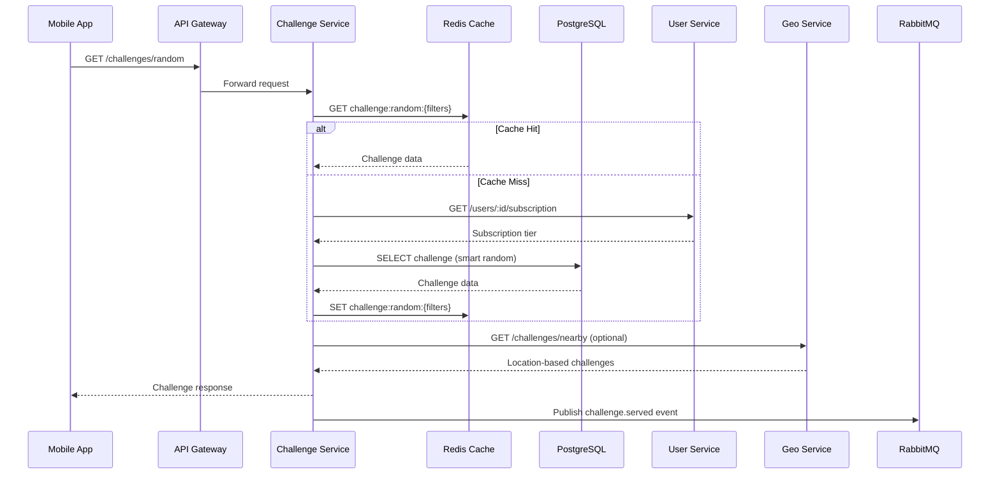
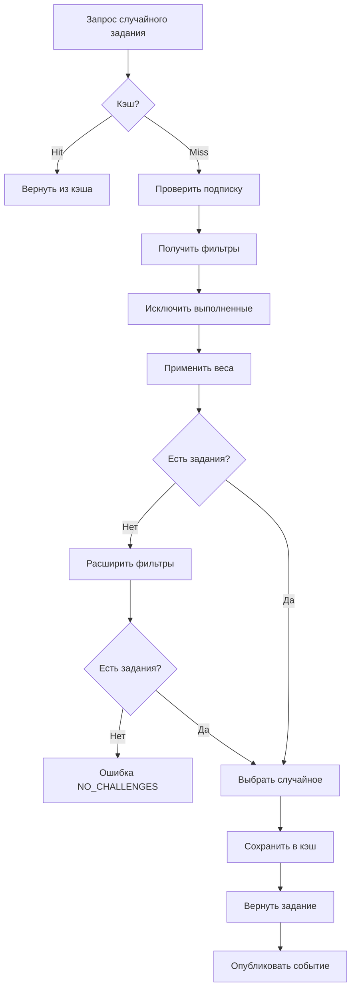

# Спецификация Challenge Service

**Версия:** 1.0  
**Дата:** 10 марта 2026 г.  
**Статус:** Готово к разработке

---

## 1. Архитектура сервиса

### 1.1. Обзор и зона ответственности

**Challenge Service** — это микросервис, отвечающий за управление базой заданий и их умную генерацию для пользователей StreetEye.

**Входит в зону ответственности:**
- ✅ CRUD операций с заданиями (создание, чтение, обновление, удаление)
- ✅ Управление категориями и тегами заданий
- ✅ Умная генерация случайных заданий (рандомайзер)
- ✅ Фильтрация по категориям, сложности, режимам
- ✅ Режимы Quick Walk и Heat Mode
- ✅ Кэширование заданий в Redis
- ✅ Location-based фильтрация (интеграция с Geo Service)

**НЕ входит в зону ответственности:**
- ❌ Выполнение заданий пользователем (Progress Service)
- ❌ Марафоны и прогресс по ним (Marathon Service)
- ❌ Хранение фото пользователей (File Service)
- ❌ AI-анализ фотографий (AI Service)
- ❌ Подписки и доступ (User Service)

### 1.2. Взаимодействие с другими сервисами



**Таблица взаимодействий:**

| Сервис | Направление | Тип | Описание |
|--------|-------------|-----|----------|
| **User Service** | Challenge → User | REST (sync) | Проверка подписки для доступа к premium заданиям |
| **Geo Service** | Challenge → Geo | REST (sync) | Получение location-based заданий |
| **Redis** | Challenge ↔ Redis | Native | Кэширование заданий, сессии Heat Mode |
| **PostgreSQL** | Challenge ↔ DB | TypeORM | Хранение заданий, категорий |
| **RabbitMQ** | Challenge → MQ | Publish | События: `challenge.served`, `challenge.created` |
| **Analytics Service** | Challenge → Analytics | Via MQ | События для аналитики |
| **Progress Service** | Progress → Challenge | Via DB | Чтение данных заданий (не напрямую) |

### 1.3. Внутренняя структура модулей

```
challenge-service/
├── src/
│   ├── main.ts                          # Точка входа
│   ├── app.module.ts                    # Главный модуль
│   ├── config/                          # Конфигурация
│   │   ├── database.config.ts
│   │   ├── redis.config.ts
│   │   └── rabbitmq.config.ts
│   ├── challenges/                      # Основной модуль
│   │   ├── challenges.module.ts
│   │   ├── controllers/
│   │   │   ├── challenges.controller.ts
│   │   │   └── heat-mode.controller.ts
│   │   ├── services/
│   │   │   ├── challenges.service.ts
│   │   │   ├── randomizer.service.ts
│   │   │   ├── heat-mode.service.ts
│   │   │   └── categories.service.ts
│   │   ├── repositories/
│   │   │   ├── challenges.repository.ts
│   │   │   └── categories.repository.ts
│   │   ├── dto/
│   │   │   ├── create-challenge.dto.ts
│   │   │   ├── update-challenge.dto.ts
│   │   │   ├── get-random-challenge.dto.ts
│   │   │   └── challenge-response.dto.ts
│   │   ├── entities/
│   │   │   ├── challenge.entity.ts
│   │   │   └── challenge-category.entity.ts
│   │   └── interfaces/
│   │       ├── challenge.interface.ts
│   │       └── randomizer-options.interface.ts
│   ├── shared/                          # Общие модули
│   │   ├── decorators/
│   │   ├── guards/
│   │   ├── interceptors/
│   │   └── filters/
│   └── events/                          # События
│       └── challenge.events.ts
```

---

## 2. API спецификация

### 2.1. Основные endpoints

#### GET /api/v1/challenges/random

Умная генерация случайного задания с фильтрами.

```
METHOD: GET
Path: /api/v1/challenges/random
Auth: required (optional для free пользователей — только базовые задания)

Request Query Params:
{
  category?: 'technical' | 'visual' | 'social' | 'restriction',
  difficulty?: 'beginner' | 'intermediate' | 'pro',
  mode?: 'quick_walk' | 'heat_mode' | 'location_based',
  location?: { lat: number, lng: number, radius?: number },
  excludeIds?: string[]  // Исключить выполненные задания
}

Response: 200 OK
{
  id: string (UUID),
  title: string,
  titleRu: string,
  titleEn: string,
  category: {
    id: string,
    name: string,
    nameRu: string,
    nameEn: string
  },
  difficulty: 'beginner' | 'intermediate' | 'pro',
  description: string,
  descriptionRu: string,
  descriptionEn: string,
  tips: string,
  tipsRu: string,
  tipsEn: string,
  tags: string[],
  estimatedTimeMinutes: number,
  examplePhotoUrls: string[],
  isPremium: boolean,
  location?: {
    lat: number,
    lng: number,
    distanceMeters: number
  }
}

Errors:
- 400 BAD_REQUEST: INVALID_FILTER, INVALID_LOCATION
- 403 FORBIDDEN: PREMIUM_REQUIRED
- 404 NOT_FOUND: NO_CHALLENGES_AVAILABLE
- 429 TOO_MANY_REQUESTS: RATE_LIMIT_EXCEEDED

Rate limit: 30 запросов в минуту
```

---

#### GET /api/v1/challenges/:id

Получение задания по ID.

```
METHOD: GET
Path: /api/v1/challenges/:id
Auth: optional (публичные данные задания)

Response: 200 OK
{
  id: string,
  title: string,
  titleRu: string,
  titleEn: string,
  category: {
    id: string,
    name: string,
    nameRu: string
  },
  difficulty: string,
  description: string,
  descriptionRu: string,
  tips: string,
  tipsRu: string,
  tags: string[],
  estimatedTimeMinutes: number,
  examplePhotoUrls: string[],
  isPremium: boolean,
  relatedMarathons: [{ id: string, title: string }]
}

Errors:
- 404 NOT_FOUND: CHALLENGE_NOT_FOUND

Rate limit: 60 запросов в минуту
```

---

#### GET /api/v1/challenges

Список заданий с фильтрацией и пагинацией.

```
METHOD: GET
Path: /api/v1/challenges
Auth: optional

Request Query Params:
{
  category?: string,
  difficulty?: string,
  isPremium?: boolean,
  tags?: string[],
  page?: number (default: 1),
  limit?: number (default: 20, max: 100),
  sortBy?: 'created_at' | 'difficulty' | 'estimated_time',
  sortOrder?: 'asc' | 'desc'
}

Response: 200 OK
{
  challenges: [{
    id: string,
    title: string,
    category: { id: string, name: string },
    difficulty: string,
    estimatedTimeMinutes: number,
    isPremium: boolean,
    tags: string[]
  }],
  pagination: {
    total: number,
    page: number,
    limit: number,
    totalPages: number,
    hasNextPage: boolean,
    hasPrevPage: boolean
  }
}

Errors:
- 400 BAD_REQUEST: INVALID_FILTER, INVALID_PAGINATION

Rate limit: 30 запросов в минуту
```

---

#### GET /api/v1/challenges/categories

Список всех категорий заданий.

```
METHOD: GET
Path: /api/v1/challenges/categories
Auth: none (публичный endpoint)

Response: 200 OK
{
  categories: [{
    id: string,
    name: string,
    nameRu: string,
    nameEn: string,
    description: string,
    descriptionRu: string,
    iconUrl: string,
    sortOrder: number,
    challengesCount: {
      total: number,
      byDifficulty: {
        beginner: number,
        intermediate: number,
        pro: number
      }
    }
  }]
}

Rate limit: 60 запросов в минуту
```

---

#### POST /api/v1/challenges

Создание нового задания (admin only).

```
METHOD: POST
Path: /api/v1/challenges
Auth: required (admin role)

Request Body:
{
  title: string (min: 5, max: 100),
  titleRu: string (min: 5, max: 100),
  titleEn: string (min: 5, max: 100),
  categoryId: string,
  difficulty: 'beginner' | 'intermediate' | 'pro',
  description: string (min: 20, max: 1000),
  descriptionRu: string,
  descriptionEn: string,
  tips: string (optional, max: 500),
  tipsRu: string,
  tipsEn: string,
  tags: string[] (max: 10),
  estimatedTimeMinutes: number (min: 5, max: 180),
  isPremium: boolean (default: false),
  examplePhotoUrls: string[] (max: 3, optional)
}

Response: 201 Created
{
  id: string,
  title: string,
  slug: string,
  createdAt: string (ISO 8601)
}

Errors:
- 400 BAD_REQUEST: INVALID_DATA, VALIDATION_ERROR
- 401 UNAUTHORIZED: UNAUTHORIZED
- 403 FORBIDDEN: ADMIN_REQUIRED
- 409 CONFLICT: CATEGORY_NOT_FOUND

Rate limit: 10 запросов в минуту
```

---

#### PUT /api/v1/challenges/:id

Обновление задания (admin only).

```
METHOD: PUT
Path: /api/v1/challenges/:id
Auth: required (admin role)

Request Body: (все поля optional)
{
  title?: string,
  titleRu?: string,
  titleEn?: string,
  categoryId?: string,
  difficulty?: string,
  description?: string,
  descriptionRu?: string,
  descriptionEn?: string,
  tips?: string,
  tipsRu?: string,
  tipsEn?: string,
  tags?: string[],
  estimatedTimeMinutes?: number,
  isPremium?: boolean,
  examplePhotoUrls?: string[]
}

Response: 200 OK
{
  id: string,
  title: string,
  updatedAt: string (ISO 8601)
}

Errors:
- 400 BAD_REQUEST: INVALID_DATA, VALIDATION_ERROR
- 401 UNAUTHORIZED: UNAUTHORIZED
- 403 FORBIDDEN: ADMIN_REQUIRED
- 404 NOT_FOUND: CHALLENGE_NOT_FOUND
- 409 CONFLICT: CATEGORY_NOT_FOUND

Rate limit: 10 запросов в минуту
```

---

#### DELETE /api/v1/challenges/:id

Удаление задания (soft delete, admin only).

```
METHOD: DELETE
Path: /api/v1/challenges/:id
Auth: required (admin role)

Response: 204 No Content

Errors:
- 401 UNAUTHORIZED: UNAUTHORIZED
- 403 FORBIDDEN: ADMIN_REQUIRED
- 404 NOT_FOUND: CHALLENGE_NOT_FOUND

Rate limit: 10 запросов в минуту
```

---

### 2.2. Heat Mode endpoints

#### POST /api/v1/challenges/heat-mode/start

Начать сессию Heat Mode.

```
METHOD: POST
Path: /api/v1/challenges/heat-mode/start
Auth: required (Premium+)

Request Body:
{
  duration: number (в минутах, 15-120),
  category?: string,
  difficulty?: string
}

Response: 201 Created
{
  sessionId: string (UUID),
  status: 'active',
  startedAt: string (ISO 8601),
  expiresAt: string (ISO 8601),
  duration: number,
  intervalMinutes: number (default: 15),
  currentChallenge: {
    id: string,
    title: string,
    category: string,
    difficulty: string,
    description: string
  },
  nextChallengeAt: string (ISO 8601),
  challengesRemaining: number
}

Errors:
- 400 BAD_REQUEST: INVALID_DURATION
- 403 FORBIDDEN: PREMIUM_REQUIRED
- 409 CONFLICT: ACTIVE_SESSION_EXISTS

Rate limit: 10 запросов в минуту
```

---

#### GET /api/v1/challenges/heat-mode/active

Получить активную сессию Heat Mode.

```
METHOD: GET
Path: /api/v1/challenges/heat-mode/active
Auth: required

Response: 200 OK
{
  sessionId: string,
  status: 'active' | 'completed' | 'expired',
  startedAt: string,
  expiresAt: string,
  currentChallenge: {
    id: string,
    title: string,
    category: string,
    difficulty: string,
    description: string,
    tips: string
  },
  challengesCompleted: number,
  challengesTotal: number,
  nextChallengeAt: string,
  timeRemaining: number (в секундах)
}

Errors:
- 404 NOT_FOUND: NO_ACTIVE_SESSION

Rate limit: 60 запросов в минуту
```

---

#### POST /api/v1/challenges/heat-mode/:sessionId/next

Получить следующее задание в сессии Heat Mode.

```
METHOD: POST
Path: /api/v1/challenges/heat-mode/:sessionId/next
Auth: required

Response: 200 OK
{
  sessionId: string,
  challenge: {
    id: string,
    title: string,
    category: string,
    difficulty: string,
    description: string,
    tips: string
  },
  nextChallengeAt: string,
  challengesRemaining: number
}

Errors:
- 404 NOT_FOUND: NO_ACTIVE_SESSION, SESSION_NOT_FOUND
- 409 CONFLICT: NO_MORE_CHALLENGES, NOT_TIME_YET

Rate limit: 30 запросов в минуту
```

---

#### DELETE /api/v1/challenges/heat-mode/:sessionId

Завершить сессию Heat Mode досрочно.

```
METHOD: DELETE
Path: /api/v1/challenges/heat-mode/:sessionId
Auth: required

Response: 200 OK
{
  sessionId: string,
  status: 'completed',
  challengesCompleted: number,
  sessionDuration: number (в минутах)
}

Errors:
- 404 NOT_FOUND: SESSION_NOT_FOUND

Rate limit: 10 запросов в минуту
```

---

## 3. Логика рандомайзера

### 3.1. Алгоритм выбора случайного задания

**Цель:** Равномерное распределение заданий с учётом предпочтений пользователя и истории выполнений.



### 3.2. Система весов

Каждое задание получает вес для генерации:

```typescript
interface ChallengeWeight {
  challengeId: string;
  baseWeight: number;      // Базовый вес (1.0)
  categoryWeight: number;  // Множитель категории
  difficultyWeight: number; // Множитель сложности
  freshnessWeight: number;  // Вес "свежести" (не выполнялось давно)
  userPreferenceWeight: number; // Предпочтения пользователя
  finalWeight: number;     // Итоговый вес
}

// Формула расчёта
finalWeight = baseWeight * categoryWeight * difficultyWeight * freshnessWeight * userPreferenceWeight
```

**Множители:**

| Фактор | Условие | Множитель |
|--------|---------|-----------|
| **Категория** | Запрошенная категория | 2.0 |
| | Другая категория | 1.0 |
| **Сложность** | Запрошенная сложность | 1.5 |
| | Другая сложность | 1.0 |
| **Свежесть** | Не выполнялось > 30 дней | 1.5 |
| | Не выполнялось 7-30 дней | 1.2 |
| | Не выполнялось < 7 дней | 0.5 |
| | Выполнялось | 0 (исключается) |
| **Предпочтения** | Любимая категория пользователя | 1.3 |
| | Слабая категория (мало выполнено) | 1.2 |

### 3.3. Механизм исключения повторений

```typescript
class RandomizerService {
  private readonly EXCLUSION_WINDOW_DAYS = 30;
  
  async getRandomChallenge(options: RandomizerOptions): Promise<Challenge> {
    // 1. Получить IDs выполненных заданий за период исключения
    const completedIds = await this.progressService.getCompletedChallengeIds(
      options.userId,
      this.EXCLUSION_WINDOW_DAYS
    );
    
    // 2. Исключить из выборки
    const query = this.challengesRepository
      .createQueryBuilder('challenge')
      .where('challenge.id NOT IN (:...completedIds)', { completedIds })
      .andWhere('challenge.isActive = :isActive', { isActive: true });
    
    // 3. Применить фильтры
    if (options.category) {
      query.andWhere('challenge.categoryId = :categoryId', { 
        categoryId: options.category 
      });
    }
    
    if (options.difficulty) {
      query.andWhere('challenge.difficulty = :difficulty', { 
        difficulty: options.difficulty 
      });
    }
    
    // 4. Проверить подписку для premium заданий
    if (!options.isPremium) {
      query.andWhere('challenge.isPremium = :isPremium', { isPremium: false });
    }
    
    // 5. Получить все подходящие задания
    const challenges = await query.getMany();
    
    if (challenges.length === 0) {
      // 6. Если нет заданий, расширить фильтры
      return this.getWithRelaxedFilters(options, completedIds);
    }
    
    // 7. Рассчитать веса
    const weightedChallenges = await this.calculateWeights(
      challenges, 
      options.userId
    );
    
    // 8. Выбрать случайное с учётом весов
    const selected = this.weightedRandom(weightedChallenges);
    
    return selected;
  }
  
  private weightedRandom(challenges: WeightedChallenge[]): Challenge {
    const totalWeight = challenges.reduce((sum, c) => sum + c.finalWeight, 0);
    let random = Math.random() * totalWeight;
    
    for (const challenge of challenges) {
      random -= challenge.finalWeight;
      if (random <= 0) {
        return challenge.challenge;
      }
    }
    
    return challenges[challenges.length - 1].challenge;
  }
}
```

### 3.4. Обработка граничных случаев

| Случай | Действие |
|--------|----------|
| **Нет заданий с фильтрами** | Расширить фильтры (снять категорию, затем сложность) |
| **Все задания выполнены** | Сбросить окно исключения до 7 дней |
| **Только premium задания** | Вернуть ошибку PREMIUM_REQUIRED с предложением апгрейда |
| **Ошибка БД** | Вернуть ошибку DATABASE_ERROR, логировать, retry (max 2) |
| **Пустой кэш Redis** | Игнорировать, запросить из БД |

### 3.5. Псевдокод алгоритма

```
FUNCTION getRandomChallenge(userId, filters):
    // Шаг 1: Проверка кэша
    cacheKey = buildCacheKey(filters)
    cached = Redis.GET(cacheKey)
    IF cached != NULL:
        RETURN deserialize(cached)
    
    // Шаг 2: Проверка подписки
    user = UserService.getSubscription(userId)
    IF filters.requiresPremium AND user.tier == 'free':
        THROW PREMIUM_REQUIRED
    
    // Шаг 3: Получить выполненные задания
    completedIds = ProgressService.getCompletedIds(userId, 30 days)
    
    // Шаг 4: Построить запрос
    query = SELECT * FROM challenges
            WHERE isActive = true
            AND id NOT IN completedIds
            AND categoryId = filters.category (IF set)
            AND difficulty = filters.difficulty (IF set)
    
    IF user.tier == 'free':
        AND isPremium = false
    
    challenges = query.execute()
    
    // Шаг 5: Если нет заданий, расширить фильтры
    IF challenges.length == 0:
        challenges = getWithRelaxedFilters(userId, completedIds)
        IF challenges.length == 0:
            THROW NO_CHALLENGES_AVAILABLE
    
    // Шаг 6: Рассчитать веса
    weightedChallenges = []
    FOR EACH challenge IN challenges:
        weight = calculateWeight(challenge, userId, filters)
        weightedChallenges.push({challenge, weight})
    
    // Шаг 7: Выбрать случайное с весами
    selected = weightedRandom(weightedChallenges)
    
    // Шаг 8: Сохранить в кэш
    Redis.SET(cacheKey, serialize(selected), TTL=300)
    
    // Шаг 9: Опубликовать событие
    RabbitMQ.publish('challenge.served', {
        userId,
        challengeId: selected.id,
        filters,
        timestamp: NOW()
    })
    
    RETURN selected
```

---

## 4. Схема базы данных

### 4.1. Таблицы сервиса

#### challenge_categories

```sql
CREATE TABLE challenge_categories (
    id VARCHAR(50) PRIMARY KEY,
    name VARCHAR(100) NOT NULL,
    name_ru VARCHAR(100) NOT NULL,
    name_en VARCHAR(100) NOT NULL,
    description TEXT,
    description_ru TEXT,
    description_en TEXT,
    icon_url VARCHAR(500),
    sort_order INT NOT NULL DEFAULT 0,
    created_at TIMESTAMP WITH TIME ZONE DEFAULT NOW(),
    updated_at TIMESTAMP WITH TIME ZONE DEFAULT NOW()
);

-- Индексы
CREATE INDEX idx_categories_sort ON challenge_categories(sort_order);

-- Данные по умолчанию
INSERT INTO challenge_categories (id, name, name_ru, name_en, description, sort_order) VALUES
('technical', 'Technical', 'Технические', 'Technical', 'Работа с камерой и настройками', 1),
('visual', 'Visual', 'Визуальные', 'Visual', 'Композиция, свет, цвет', 2),
('social', 'Social', 'Социальные', 'Social', 'Люди, взаимодействия, истории', 3),
('restriction', 'Restriction', 'Ограничения', 'Restriction', 'Искусственные ограничения', 4);
```

| Поле | Тип | Описание |
|------|-----|----------|
| id | VARCHAR(50) | Первичный ключ (technical, visual, social, restriction) |
| name | VARCHAR(100) | Название (EN) |
| name_ru | VARCHAR(100) | Название (RU) |
| name_en | VARCHAR(100) | Название (EN) |
| description | TEXT | Описание (EN) |
| description_ru | TEXT | Описание (RU) |
| description_en | TEXT | Описание (EN) |
| icon_url | VARCHAR(500) | URL иконки категории |
| sort_order | INT | Порядок сортировки |

---

#### challenges

```sql
CREATE TABLE challenges (
    id UUID PRIMARY KEY DEFAULT gen_random_uuid(),
    title VARCHAR(255) NOT NULL,
    title_ru VARCHAR(255) NOT NULL,
    title_en VARCHAR(255) NOT NULL,
    category_id VARCHAR(50) NOT NULL REFERENCES challenge_categories(id),
    difficulty VARCHAR(20) NOT NULL CHECK (difficulty IN ('beginner', 'intermediate', 'pro')),
    description TEXT NOT NULL,
    description_ru TEXT NOT NULL,
    description_en TEXT NOT NULL,
    tips TEXT,
    tips_ru TEXT,
    tips_en TEXT,
    tags TEXT[] DEFAULT '{}',
    estimated_time_minutes INT DEFAULT 30 CHECK (estimated_time_minutes BETWEEN 5 AND 180),
    is_premium BOOLEAN DEFAULT false,
    is_active BOOLEAN DEFAULT true,
    example_photo_urls VARCHAR(500)[],
    view_count INT DEFAULT 0,
    completion_count INT DEFAULT 0,
    average_rating DECIMAL(3, 2),
    created_at TIMESTAMP WITH TIME ZONE DEFAULT NOW(),
    updated_at TIMESTAMP WITH TIME ZONE DEFAULT NOW(),
    deleted_at TIMESTAMP WITH TIME ZONE
);

-- Индексы
CREATE INDEX idx_challenges_category ON challenges(category_id);
CREATE INDEX idx_challenges_difficulty ON challenges(difficulty);
CREATE INDEX idx_challenges_is_premium ON challenges(is_premium);
CREATE INDEX idx_challenges_is_active ON challenges(is_active);
CREATE INDEX idx_challenges_tags ON challenges USING GIN(tags);
CREATE INDEX idx_challenges_random ON challenges(is_active, category_id, difficulty, is_premium);
CREATE INDEX idx_challenges_created_at ON challenges(created_at DESC);

-- Частичный индекс для активных заданий
CREATE INDEX idx_challenges_active_not_deleted 
ON challenges(id, category_id, difficulty) 
WHERE is_active = true AND deleted_at IS NULL;
```

| Поле | Тип | Описание |
|------|-----|----------|
| id | UUID | Первичный ключ |
| title | VARCHAR(255) | Название (основное) |
| title_ru | VARCHAR(255) | Название (RU) |
| title_en | VARCHAR(255) | Название (EN) |
| category_id | VARCHAR(50) | Foreign key к challenge_categories |
| difficulty | VARCHAR(20) | Уровень: beginner/intermediate/pro |
| description | TEXT | Описание задания |
| description_ru | TEXT | Описание (RU) |
| description_en | TEXT | Описание (EN) |
| tips | TEXT | Советы для выполнения |
| tips_ru | TEXT | Советы (RU) |
| tips_en | TEXT | Советы (EN) |
| tags | TEXT[] | Теги для фильтрации |
| estimated_time_minutes | INT | Оценка времени (5-180 мин) |
| is_premium | BOOLEAN | Требуется Premium подписка |
| is_active | BOOLEAN | Активно ли задание |
| example_photo_urls | VARCHAR[] | URL примеров работ |
| view_count | INT | Количество выдач задания |
| completion_count | INT | Количество выполнений |
| average_rating | DECIMAL | Средний рейтинг (0-5) |
| created_at | TIMESTAMP | Дата создания |
| updated_at | TIMESTAMP | Дата обновления |
| deleted_at | TIMESTAMP | Soft delete |

---

#### challenge_locations

```sql
CREATE TABLE challenge_locations (
    id UUID PRIMARY KEY DEFAULT gen_random_uuid(),
    challenge_id UUID NOT NULL REFERENCES challenges(id) ON DELETE CASCADE,
    title VARCHAR(255) NOT NULL,
    title_ru VARCHAR(255),
    title_en VARCHAR(255),
    description TEXT,
    description_ru TEXT,
    description_en TEXT,
    location_lat DECIMAL(10, 8) NOT NULL,
    location_lng DECIMAL(11, 8) NOT NULL,
    radius_meters INT DEFAULT 100 CHECK (radius_meters BETWEEN 50 AND 5000),
    is_active BOOLEAN DEFAULT true,
    created_at TIMESTAMP WITH TIME ZONE DEFAULT NOW(),
    updated_at TIMESTAMP WITH TIME ZONE DEFAULT NOW()
);

-- Индексы
CREATE INDEX idx_challenge_locations_challenge_id ON challenge_locations(challenge_id);
CREATE INDEX idx_challenge_locations_location ON challenge_locations USING GIST (
    ll_to_earth(location_lat, location_lng)
);
CREATE INDEX idx_challenge_locations_is_active ON challenge_locations(is_active);
CREATE INDEX idx_challenge_locations_active_location 
ON challenge_locations(challenge_id, location_lat, location_lng) 
WHERE is_active = true;
```

| Поле | Тип | Описание |
|------|-----|----------|
| id | UUID | Первичный ключ |
| challenge_id | UUID | Foreign key к challenges |
| title | VARCHAR(255) | Название локации |
| description | TEXT | Описание места |
| location_lat | DECIMAL(10, 8) | Широта (-90 до 90) |
| location_lng | DECIMAL(11, 8) | Долгота (-180 до 180) |
| radius_meters | INT | Радиус активности (50-5000м) |
| is_active | BOOLEAN | Активна ли локация |

---

#### heat_mode_sessions

```sql
CREATE TABLE heat_mode_sessions (
    id UUID PRIMARY KEY DEFAULT gen_random_uuid(),
    user_id UUID NOT NULL,
    status VARCHAR(20) NOT NULL DEFAULT 'active' 
        CHECK (status IN ('active', 'completed', 'expired', 'cancelled')),
    duration_minutes INT NOT NULL CHECK (duration_minutes BETWEEN 15 AND 120),
    interval_minutes INT NOT NULL DEFAULT 15 CHECK (interval_minutes BETWEEN 5 AND 60),
    category_filter VARCHAR(50),
    difficulty_filter VARCHAR(20),
    challenges_served INT DEFAULT 0,
    started_at TIMESTAMP WITH TIME ZONE NOT NULL DEFAULT NOW(),
    expires_at TIMESTAMP WITH TIME ZONE NOT NULL,
    completed_at TIMESTAMP WITH TIME ZONE,
    created_at TIMESTAMP WITH TIME ZONE DEFAULT NOW()
);

-- Индексы
CREATE INDEX idx_heat_sessions_user_id ON heat_mode_sessions(user_id);
CREATE INDEX idx_heat_sessions_status ON heat_mode_sessions(status);
CREATE INDEX idx_heat_sessions_expires_at ON heat_mode_sessions(expires_at);
CREATE INDEX idx_heat_sessions_active_user 
ON heat_mode_sessions(id, user_id) 
WHERE status = 'active';

-- Частичная уникальность: одна активная сессия на пользователя
CREATE UNIQUE INDEX idx_heat_sessions_one_active_per_user 
ON heat_mode_sessions(user_id) 
WHERE status = 'active';
```

| Поле | Тип | Описание |
|------|-----|----------|
| id | UUID | Первичный ключ |
| user_id | UUID | ID пользователя |
| status | VARCHAR(20) | Статус: active/completed/expired/cancelled |
| duration_minutes | INT | Длительность сессии (15-120 мин) |
| interval_minutes | INT | Интервал между заданиями (5-60 мин) |
| category_filter | VARCHAR(50) | Фильтр категории (optional) |
| difficulty_filter | VARCHAR(20) | Фильтр сложности (optional) |
| challenges_served | INT | Количество выданных заданий |
| started_at | TIMESTAMP | Начало сессии |
| expires_at | TIMESTAMP | Окончание (started_at + duration) |
| completed_at | TIMESTAMP | Фактическое завершение |

---

#### heat_mode_session_challenges

```sql
CREATE TABLE heat_mode_session_challenges (
    id UUID PRIMARY KEY DEFAULT gen_random_uuid(),
    session_id UUID NOT NULL REFERENCES heat_mode_sessions(id) ON DELETE CASCADE,
    challenge_id UUID NOT NULL REFERENCES challenges(id),
    served_at TIMESTAMP WITH TIME ZONE NOT NULL DEFAULT NOW(),
    completed BOOLEAN DEFAULT false,
    completed_at TIMESTAMP WITH TIME ZONE,
    UNIQUE(session_id, challenge_id)
);

-- Индексы
CREATE INDEX idx_heat_challenges_session_id ON heat_mode_session_challenges(session_id);
CREATE INDEX idx_heat_challenges_challenge_id ON heat_mode_session_challenges(challenge_id);
CREATE INDEX idx_heat_challenges_served_at ON heat_mode_session_challenges(served_at);
```

| Поле | Тип | Описание |
|------|-----|----------|
| id | UUID | Первичный ключ |
| session_id | UUID | Foreign key к heat_mode_sessions |
| challenge_id | UUID | Foreign key к challenges |
| served_at | TIMESTAMP | Когда выдано задание |
| completed | BOOLEAN | Выполнено ли пользователем |
| completed_at | TIMESTAMP | Когда выполнено |

---

### 4.2. Примеры данных для тестирования

```sql
-- Категории (уже есть по умолчанию)
-- Задания
INSERT INTO challenges (id, title, title_ru, title_en, category_id, difficulty, description, description_ru, tips, estimated_time_minutes, is_premium, tags) VALUES
('00000000-0000-0000-0000-000000000001', '35mm Only', 'Только 35мм', '35mm Only', 'technical', 'beginner', 'Shoot entire walk using only 35mm focal length', 'Снимайте всю прогулку только на фокусное расстояние 35мм', 'Fix your lens or crop in post. Focus on framing.', 45, false, '{"focal_length", "discipline", "beginner"}'),
('00000000-0000-0000-0000-000000000002', 'Shadows', 'Тени', 'Shadows', 'visual', 'intermediate', 'Find and photograph interesting shadows', 'Найдите и сфотографируйте интересные тени', 'Look for strong contrast. Shadows can be your subject or frame.', 60, false, '{"light", "contrast", "composition"}'),
('00000000-0000-0000-0000-000000000003', 'Hands', 'Руки', 'Hands', 'social', 'pro', 'Photograph people''s hands telling a story', 'Сфотографируйте руки людей, рассказывающие историю', 'Hands reveal profession, emotion, age. Be respectful.', 90, true, '{"people", "storytelling", "details"}');

-- Локации
INSERT INTO challenge_locations (challenge_id, title, title_ru, location_lat, location_lng, radius_meters) VALUES
('00000000-0000-0000-0000-000000000001', 'Red Square', 'Красная площадь', 55.7539, 37.6208, 500);
```

---

## 5. Кэширование (Redis)

### 5.1. Стратегии кэширования

#### Кэш случайных заданий

```
Ключ: challenge:random:{category}:{difficulty}:{premium}
TTL: 5 минут (300 секунд)
Данные: JSON сериализованное задание
Инвалидация: 
  - По TTL
  - При обновлении/удалении задания (invalidate by pattern)
  - При добавлении нового задания в категорию

Пример:
  challenge:random:technical:beginner:false -> { id: "...", title: "..." }
```

#### Кэш задания по ID

```
Ключ: challenge:{id}
TTL: 1 час (3600 секунд)
Данные: Полные данные задания с категорией
Инвалидация:
  - При обновлении задания
  - При soft delete

Пример:
  challenge:00000000-0000-0000-0000-000000000001 -> { ...full challenge data... }
```

#### Кэш списка категорий

```
Ключ: challenge:categories
TTL: 1 час (3600 секунд)
Данные: Массив категорий с количеством заданий
Инвалидация:
  - При добавлении/удалении категории
  - При значительном изменении количества заданий (cron раз в час)

Пример:
  challenge:categories -> [
    { id: "technical", name: "Технические", challengesCount: 25 },
    ...
  ]
```

#### Кэш сессий Heat Mode

```
Ключ: heatmode:session:{sessionId}
TTL: 2 часа (7200 секунд)
Данные: Данные активной сессии
Инвалидация:
  - При завершении сессии
  - По TTL (сессия истекла)

Пример:
  heatmode:session:uuid -> { 
    sessionId: "...", 
    status: "active", 
    currentChallengeId: "...",
    nextChallengeAt: "2026-03-10T13:00:00Z"
  }
```

```
Ключ: heatmode:user:{userId}
TTL: 2 часа (7200 секунд)
Данные: ID активной сессии пользователя
Инвалидация:
  - При завершении сессии

Пример:
  heatmode:user:userId -> sessionId
```

#### Rate Limiting

```
Ключ: ratelimit:{endpoint}:{identifier}
TTL: 1 минута (60 секунд)
Данные: Счётчик запросов
Инвалидация: Автоматически по TTL

Пример:
  ratelimit:challenges:random:ip:192.168.1.1 -> 15
  ratelimit:challenges:random:user:userId -> 10
```

### 5.2. Реализация кэширования в сервисе

```typescript
@Injectable()
export class ChallengesService {
  private readonly CACHE_PREFIX = 'challenge:';
  
  constructor(
    @Inject(CACHE_MANAGER) private cacheManager: Cache,
    private challengesRepository: ChallengesRepository,
  ) {}
  
  async getRandomChallenge(filters: RandomizerOptions): Promise<Challenge> {
    // 1. Построить ключ кэша
    const cacheKey = this.buildCacheKey(filters);
    
    // 2. Проверить кэш
    const cached = await this.cacheManager.get<Challenge>(cacheKey);
    if (cached) {
      return cached;
    }
    
    // 3. Кэш промах - запрос в БД
    const challenge = await this.randomizerService.getRandom(filters);
    
    // 4. Сохранить в кэш
    await this.cacheManager.set(
      cacheKey,
      challenge,
      { ttl: 300 } // 5 минут
    );
    
    return challenge;
  }
  
  async getChallengeById(id: string): Promise<Challenge | null> {
    const cacheKey = `${this.CACHE_PREFIX}${id}`;
    
    const cached = await this.cacheManager.get<Challenge>(cacheKey);
    if (cached) {
      return cached;
    }
    
    const challenge = await this.challengesRepository.findOne({
      where: { id, isActive: true },
      relations: ['category'],
    });
    
    if (challenge) {
      await this.cacheManager.set(cacheKey, challenge, { ttl: 3600 });
    }
    
    return challenge;
  }
  
  async invalidateChallengeCache(challengeId: string): Promise<void> {
    // Инвалидация по паттерну
    const pattern = `${this.CACHE_PREFIX}*${challengeId}*`;
    // Redis-specific invalidation
    await this.cacheManager.del(pattern);
  }
  
  private buildCacheKey(filters: RandomizerOptions): string {
    const parts = [
      `${this.CACHE_PREFIX}random`,
      filters.category || 'any',
      filters.difficulty || 'any',
      filters.isPremium ? 'premium' : 'free',
    ];
    return parts.join(':');
  }
}
```

### 5.3. Конфигурация Redis

```typescript
// redis.config.ts
export const redisConfig = {
  host: process.env.REDIS_HOST || 'localhost',
  port: parseInt(process.env.REDIS_PORT, 10) || 6379,
  password: process.env.REDIS_PASSWORD,
  db: parseInt(process.env.REDIS_DB, 10) || 0,
  
  // Pool settings
  maxRetriesPerRequest: 3,
  retryDelayOnFail: 100,
  
  // Key namespace
  keyPrefix: 'streeteye:challenge:',
};

// Cache module configuration
@Module({
  imports: [
    CacheModule.registerAsync({
      isGlobal: true,
      useFactory: async () => ({
        store: redisStore,
        ...redisConfig,
        ttl: 300, // Default 5 minutes
      }),
    }),
  ],
})
export class CacheConfigModule {}
```

---

## 6. Обработка ошибок

### 6.1. Иерархия ошибок сервиса

```
ChallengeServiceError (base)
├── ChallengeNotFoundError
├── ChallengeValidationError
│   ├── InvalidCategoryError
│   ├── InvalidDifficultyError
│   ├── InvalidTagsError
│   └── ValidationFieldError
├── ChallengeAccessError
│   ├── PremiumRequiredError
│   └── AdminRequiredError
├── ChallengeGenerationError
│   ├── NoChallengesAvailableError
│   └── RandomizerError
├── CacheError
│   ├── CacheConnectionError
│   └── CacheOperationError
└── DatabaseError
    ├── DatabaseConnectionError
    └── DatabaseOperationError
```

### 6.2. Маппинг на HTTP статус коды

| Ошибка | HTTP Status | Код ошибки |
|--------|-------------|------------|
| ChallengeNotFoundError | 404 | CHALLENGE_NOT_FOUND |
| InvalidCategoryError | 400 | INVALID_CATEGORY |
| InvalidDifficultyError | 400 | INVALID_DIFFICULTY |
| InvalidTagsError | 400 | INVALID_TAGS |
| ValidationFieldError | 400 | VALIDATION_ERROR |
| PremiumRequiredError | 403 | PREMIUM_REQUIRED |
| AdminRequiredError | 403 | ADMIN_REQUIRED |
| NoChallengesAvailableError | 404 | NO_CHALLENGES_AVAILABLE |
| RandomizerError | 500 | RANDOMIZER_ERROR |
| CacheConnectionError | 503 | CACHE_UNAVAILABLE |
| DatabaseConnectionError | 503 | DATABASE_UNAVAILABLE |
| DatabaseOperationError | 500 | DATABASE_ERROR |

### 6.3. Формат ответа при ошибке

```json
{
  "statusCode": 404,
  "error": "Not Found",
  "message": "CHALLENGE_NOT_FOUND",
  "details": {
    "challengeId": "00000000-0000-0000-0000-000000000001"
  },
  "timestamp": "2026-03-10T12:00:00.000Z",
  "path": "/api/v1/challenges/00000000-0000-0000-0000-000000000001",
  "traceId": "abc123def456"
}
```

### 6.4. Логирование ошибок

```typescript
// Exception filter для глобальной обработки ошибок
@Catch()
export class ChallengeExceptionFilter implements ExceptionFilter {
  private readonly logger = new Logger(ChallengeExceptionFilter.name);
  
  catch(exception: unknown, host: ArgumentsHost) {
    const ctx = host.switchToHttp();
    const response = ctx.getResponse<Response>();
    const request = ctx.getRequest<Request>();
    
    const status = this.getHttpStatus(exception);
    const errorResponse = this.formatErrorResponse(exception, request);
    
    // Логирование с контекстом
    this.logger.error(
      `Error: ${errorResponse.message}`,
      {
        statusCode: status,
        path: request.url,
        method: request.method,
        userId: (request as any).user?.id,
        traceId: (request.headers as any)['x-trace-id'],
        stack: exception instanceof Error ? exception.stack : undefined,
      },
    );
    
    response.status(status).json(errorResponse);
  }
}
```

**Уровни логирования:**

| Уровень | Когда используется |
|---------|-------------------|
| **error** | Ошибки БД, кэша, критичные сбои |
| **warn** | Нет заданий с фильтрами, fallback логика |
| **info** | Успешная генерация задания, создание/обновление |
| **debug** | Детали запроса, кэш хит/мисс, веса рандомайзера |

---

## 7. Тестирование

### 7.1. Unit тесты

**Что покрывать:**

| Класс/Метод | Тест-кейсы |
|-------------|------------|
| `RandomizerService.calculateWeights()` | Расчёт весов для разных сценариев |
| `RandomizerService.weightedRandom()` | Корректность взвешенного выбора |
| `ChallengesService.getChallengeById()` | Кэш хит, кэш мисс, не найдено |
| `HeatModeService.startSession()` | Валидация длительности, создание сессии |
| `HeatModeService.getNextChallenge()` | Интервалы, окончание сессии |

**Пример тест-кейса:**

```typescript
describe('RandomizerService', () => {
  describe('calculateWeights', () => {
    it('should assign higher weight to requested category', async () => {
      const challenges = [
        { id: '1', categoryId: 'technical', ... },
        { id: '2', categoryId: 'visual', ... },
      ];
      const filters = { category: 'technical' };
      
      const weights = await service.calculateWeights(challenges, 'userId', filters);
      
      expect(weights[0].finalWeight).toBeGreaterThan(weights[1].finalWeight);
    });
    
    it('should exclude completed challenges', async () => {
      const completedIds = ['1', '2'];
      const challenges = [{ id: '3', ... }];
      
      const filtered = await service.excludeCompleted(challenges, completedIds);
      
      expect(filtered).toHaveLength(1);
      expect(filtered[0].id).toBe('3');
    });
  });
});
```

### 7.2. Integration тесты

**Сценарии для тестирования:**

1. **GET /challenges/random** — успешная генерация
2. **GET /challenges/random** — premium пользователь получает premium задания
3. **GET /challenges/random** — free пользователь получает ошибку на premium
4. **POST /challenges** — admin создаёт задание
5. **POST /challenges** — non-admin получает ошибку
6. **Heat Mode** — старт сессии, получение заданий, завершение
7. **Кэширование** — повторный запрос возвращает кэш

**Пример integration теста:**

```typescript
describe('ChallengesController (e2e)', () => {
  let app: INestApplication;
  let authToken: string;
  
  beforeAll(async () => {
    const moduleFixture = await Test.createTestingModule({
      imports: [AppModule, TypeOrmModule.forFeature([Challenge, Category])],
    }).compile();
    
    app = moduleFixture.createNestApplication();
    await app.init();
    
    authToken = await getAuthToken('test@example.com');
  });
  
  it('/api/v1/challenges/random (GET) - success', () => {
    return request(app.getHttpServer())
      .get('/api/v1/challenges/random')
      .set('Authorization', `Bearer ${authToken}`)
      .expect(200)
      .expect((res) => {
        expect(res.body).toHaveProperty('id');
        expect(res.body).toHaveProperty('title');
        expect(res.body).toHaveProperty('category');
        expect(res.body).toHaveProperty('difficulty');
      });
  });
  
  it('/api/v1/challenges/random (GET) - premium required', () => {
    return request(app.getHttpServer())
      .get('/api/v1/challenges/random?difficulty=pro&category=social')
      .set('Authorization', `Bearer ${freeUserToken}`)
      .expect(403)
      .expect((res) => {
        expect(res.body.message).toBe('PREMIUM_REQUIRED');
      });
  });
});
```

### 7.3. Load тесты

**Целевые метрики:**

| Метрика | Значение |
|---------|----------|
| **RPS (Requests Per Second)** | 1000+ |
| **p50 latency** | < 50ms |
| **p95 latency** | < 100ms |
| **p99 latency** | < 200ms |
| **Error rate** | < 0.1% |
| **Cache hit rate** | > 80% |

**Сценарии нагрузки:**

```yaml
# k6 load test script
export const options = {
  stages: [
    { duration: '2m', target: 100 },   // Ramp up to 100 users
    { duration: '5m', target: 100 },   // Stay at 100 users
    { duration: '2m', target: 500 },   // Ramp up to 500 users (peak)
    { duration: '5m', target: 500 },   // Stay at 500 users
    { duration: '2m', target: 0 },     // Ramp down
  ],
  thresholds: {
    http_req_duration: ['p(95)<100'],  // 95% requests < 100ms
    http_req_failed: ['rate<0.001'],   // Error rate < 0.1%
  },
};

export default function () {
  const params = {
    headers: {
      'Authorization': `Bearer ${__ENV.AUTH_TOKEN}`,
    },
  };
  
  // Test random challenge generation
  http.get(`${BASE_URL}/api/v1/challenges/random`, params);
  
  // Test challenge by ID
  const challengeId = getRandomChallengeId();
  http.get(`${BASE_URL}/api/v1/challenges/${challengeId}`);
}
```

---

## 8. Конфигурация и деплой

### 8.1. Переменные окружения

| Название | Тип | Default | Описание |
|----------|-----|---------|----------|
| `PORT` | number | 3003 | Порт сервиса |
| `NODE_ENV` | string | development | Окружение (development/staging/production) |
| `DATABASE_URL` | string | - | PostgreSQL connection string |
| `DATABASE_POOL_SIZE` | number | 10 | Размер пула соединений БД |
| `REDIS_HOST` | string | localhost | Redis хост |
| `REDIS_PORT` | number | 6379 | Redis порт |
| `REDIS_PASSWORD` | string | - | Redis пароль (optional) |
| `REDIS_DB` | number | 0 | Redis database index |
| `RABBITMQ_URL` | string | amqp://localhost | RabbitMQ connection string |
| `USER_SERVICE_URL` | string | http://localhost:3002 | User Service URL |
| `GEO_SERVICE_URL` | string | http://localhost:3008 | Geo Service URL |
| `JWT_SECRET` | string | - | Secret для JWT токенов |
| `ADMIN_ROLE_NAME` | string | admin | Название роли администратора |
| `CACHE_TTL_DEFAULT` | number | 300 | Default TTL для кэша (секунды) |
| `HEAT_MODE_MAX_DURATION` | number | 120 | Макс. длительность Heat Mode (мин) |
| `RANDOMIZER_EXCLUSION_DAYS` | number | 30 | Окно исключения выполненных заданий (дней) |
| `LOG_LEVEL` | string | info | Уровень логирования |
| `TRACING_ENABLED` | boolean | true | Включить distributed tracing |

### 8.2. Dockerfile

```dockerfile
# Build stage
FROM node:20-alpine AS builder

WORKDIR /app

# Install dependencies
COPY package*.json ./
COPY apps/challenge-service/package.json ./apps/challenge-service/
COPY libs ./libs
RUN npm ci --only=production

# Build application
COPY apps/challenge-service ./apps/challenge-service
COPY libs ./libs
COPY nx.json ./
COPY tsconfig.base.json ./
RUN npx nx build challenge-service

# Production stage
FROM node:20-alpine AS runner

WORKDIR /app

# Create non-root user
RUN addgroup -g 1001 -S nodejs && \
    adduser -S nestjs -u 1001

# Copy built application
COPY --from=builder /app/dist ./dist
COPY --from=builder /app/node_modules ./node_modules
COPY --from=builder /app/apps/challenge-service/package.json ./

# Set ownership
RUN chown -R nestjs:nodejs /app

USER nestjs

# Expose port
EXPOSE 3003

# Health check
HEALTHCHECK --interval=30s --timeout=3s --start-period=30s --retries=3 \
  CMD node -e "require('http').get('http://localhost:3003/health', (r) => process.exit(r.statusCode === 200 ? 0 : 1))"

# Start application
CMD ["node", "dist/apps/challenge-service/main.js"]
```

### 8.3. Health check endpoints

```typescript
// Health controller
@Controller('health')
export class HealthController {
  constructor(
    private health: HealthCheckService,
    private db: TypeOrmHealthIndicator,
    private redis: RedisHealthIndicator,
    private rabbitmq: RabbitMQHealthIndicator,
  ) {}
  
  @Get()
  @HealthCheck()
  async check() {
    return this.health.check([
      () => this.db.pingCheck('database', { timeout: 500 }),
      () => this.redis.pingCheck('redis', { timeout: 200 }),
      () => this.rabbitmq.pingCheck('rabbitmq', { timeout: 500 }),
    ]);
  }
  
  @Get('ready')
  @HealthCheck()
  async ready() {
    // More strict check for readiness
    return this.health.check([
      () => this.db.pingCheck('database', { timeout: 500 }),
      () => this.redis.pingCheck('redis', { timeout: 200 }),
      async () => {
        // Check if we can query challenges
        const count = await this.challengesRepository.count({ where: { isActive: true } });
        if (count === 0) {
          throw new ServiceUnavailableException('No challenges available');
        }
        return { challenges: 'ok' };
      },
    ]);
  }
}
```

**Ответы:**

```json
// GET /health - 200 OK
{
  "status": "ok",
  "info": {
    "database": { "status": "up" },
    "redis": { "status": "up" },
    "rabbitmq": { "status": "up" }
  },
  "error": {},
  "details": {
    "database": { "status": "up" },
    "redis": { "status": "up" },
    "rabbitmq": { "status": "up" }
  }
}

// GET /health - 503 Service Unavailable (если БД недоступна)
{
  "status": "error",
  "info": {},
  "error": {
    "database": { "status": "down", "message": "Connection timeout" }
  },
  "details": {
    "database": { "status": "down", "message": "Connection timeout" }
  }
}
```

### 8.4. Readiness probe логика

**Readiness проверяет:**
1. ✅ Подключение к PostgreSQL
2. ✅ Подключение к Redis
3. ✅ Подключение к RabbitMQ
4. ✅ Наличие активных заданий в БД (count > 0)

**Liveness проверяет:**
1. ✅ Сервис отвечает на HTTP запросы
2. ✅ Нет deadlock'ов
3. ✅ Потребление памяти в норме

**Kubernetes configuration:**

```yaml
livenessProbe:
  httpGet:
    path: /health
    port: 3003
  initialDelaySeconds: 30
  periodSeconds: 10
  timeoutSeconds: 5
  failureThreshold: 3

readinessProbe:
  httpGet:
    path: /ready
    port: 3003
  initialDelaySeconds: 10
  periodSeconds: 5
  timeoutSeconds: 3
  failureThreshold: 3
```

---

## 9. События (RabbitMQ)

### 9.1. Публикуемые события

#### challenge.served

Публикуется при выдаче задания пользователю.

```typescript
// Формат сообщения
{
  eventId: string (UUID),
  eventType: 'challenge.served',
  timestamp: string (ISO 8601),
  version: '1.0',
  data: {
    userId: string,
    challengeId: string,
    categoryId: string,
    difficulty: string,
    mode: 'quick_walk' | 'heat_mode' | 'location_based',
    isPremium: boolean,
    cacheHit: boolean,
    generationTimeMs: number,
    filters: {
      category?: string,
      difficulty?: string,
      location?: { lat: number, lng: number }
    }
  }
}
```

**Продюсер:** Challenge Service  
**Консьюмеры:** Analytics Service, Progress Service

---

#### challenge.created

Публикуется при создании нового задания.

```typescript
{
  eventId: string,
  eventType: 'challenge.created',
  timestamp: string,
  data: {
    challengeId: string,
    categoryId: string,
    difficulty: string,
    isPremium: boolean,
    createdBy: string (userId)
  }
}
```

**Продюсер:** Challenge Service  
**Консьюмеры:** Analytics Service, Cache Invalidation Service

---

#### challenge.updated

Публикуется при обновлении задания.

```typescript
{
  eventId: string,
  eventType: 'challenge.updated',
  timestamp: string,
  data: {
    challengeId: string,
    updatedFields: string[],
    updatedBy: string (userId)
  }
}
```

**Продюсер:** Challenge Service  
**Консьюмеры:** Cache Invalidation Service, Analytics Service

---

#### heatmode.session.started

Публикуется при старте сессии Heat Mode.

```typescript
{
  eventId: string,
  eventType: 'heatmode.session.started',
  timestamp: string,
  data: {
    sessionId: string,
    userId: string,
    duration: number,
    interval: number,
    categoryFilter?: string,
    difficultyFilter?: string
  }
}
```

**Продюсер:** Challenge Service  
**Консьюмеры:** Analytics Service, Notification Service (для напоминаний)

---

#### heatmode.session.completed

Публикуется при завершении сессии Heat Mode.

```typescript
{
  eventId: string,
  eventType: 'heatmode.session.completed',
  timestamp: string,
  data: {
    sessionId: string,
    userId: string,
    challengesServed: number,
    challengesCompleted: number,
    sessionDuration: number,
    completionRate: number
  }
}
```

**Продюсер:** Challenge Service  
**Консьюмеры:** Analytics Service, Progress Service (для начисления достижений)

---

## 10. Метрики (Prometheus)

### 10.1. Основные метрики сервиса

```promql
# Количество запросов
http_requests_total{service="challenge-service", endpoint="/api/v1/challenges/random"}

# Latency
http_request_duration_seconds_bucket{service="challenge-service"}

# Кэш хит rate
challenge_cache_hits_total / challenge_cache_requests_total

# Рандомайзер
challenge_randomizer_generation_duration_seconds
challenge_randomizer_attempts_total

# Heat Mode
heatmode_active_sessions
heatmode_challenges_served_total

# Ошибки
http_requests_total{service="challenge-service", status=~"5.."}
```

### 10.2. Дашборд (Grafana)

**Панели:**
1. Request Rate (RPS) по endpoints
2. Latency (p50, p95, p99)
3. Cache Hit Rate
4. Error Rate
5. Active Heat Mode Sessions
6. Challenges Generated (total, by category, by difficulty)
7. Database Query Time
8. Redis Operations

---

## Критерии успеха спецификации

Спецификация считается завершённой и готовой к разработке, если:

- ✅ Все API endpoints имеют полные Request/Response схемы
- ✅ Алгоритм рандомайзера описан с псевдокодом и весами
- ✅ Индексы БД обоснованы (какой запрос оптимизирует)
- ✅ Стратегии кэширования определены с TTL и инвалидацией
- ✅ Обработка ошибок покрывает все сценарии
- ✅ Тесты определены (unit, integration, load)
- ✅ Конфигурация и деплой описаны полностью
- ✅ Нет противоречий с `spec.md` и `backend-spec.md`

---

*Спецификация Challenge Service v1.0*  
*Создана: 10 марта 2026 г.*  
*Проект: StreetEye*
