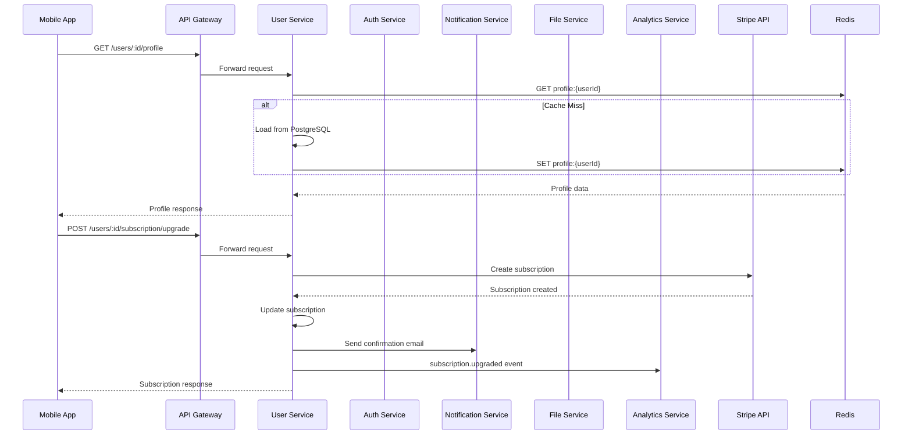

# Спецификация User Service

**Версия:** 1.0
**Дата:** 13 марта 2026 г.
**Статус:** Готово к разработке

---

## 1. Архитектура сервиса

### 1.1. Обзор и зона ответственности

**User Service** — это микросервис, отвечающий за управление профилями пользователей, подписками и монетизацией платформы StreetEye.

**Входит в зону ответственности:**
- ✅ Управление профилями пользователей
- ✅ Подписки и тарифы (Free/Premium/Masterclass)
- ✅ Покупка курсов и контента (Masterclass)
- ✅ Статистика и достижения пользователей
- ✅ Настройки пользователей (язык, уведомления)
- ✅ GDPR compliance (экспорт/удаление данных)
- ✅ Кэширование профилей в Redis

**НЕ входит в зону ответственности:**
- ❌ Аутентификация и авторизация (Auth Service)
- ❌ Обработка платежей (внешние провайдеры: Stripe, Apple, Google)
- ❌ Отправка уведомлений (Notification Service)
- ❌ Хранение файлов/аватаров (File Service)
- ❌ Статистика по заданиям (Progress Service)

### 1.2. Взаимодействие с другими сервисами



**Таблица взаимодействий:**

| Сервис | Направление | Тип | Описание |
|--------|-------------|-----|----------|
| **Auth Service** | User → Auth | REST (sync) | Валидация JWT токенов |
| **Notification Service** | User → Notification | REST (async) | Уведомления о подписках, покупках |
| **Analytics Service** | User → Analytics | Via MQ | События профиля, подписок, покупок |
| **File Service** | User → File | REST (sync) | Загрузка аватара |
| **Progress Service** | User → Progress | REST (sync) | Получение статистики пользователя |
| **Stripe** | User → Stripe | REST (sync) | Создание подписок, платежей |
| **Apple IAP** | User → Apple | REST (sync) | Восстановление покупок iOS |
| **Google Play Billing** | User → Google | REST (sync) | Восстановление покупок Android |
| **Redis** | User ↔ Redis | Native | Кэширование профилей |
| **PostgreSQL** | User ↔ DB | TypeORM | Хранение профилей, подписок, покупок |

### 1.3. Внутренняя структура модулей

```
user-service/
├── src/
│   ├── main.ts                          # Точка входа
│   ├── app.module.ts                    # Главный модуль
│   ├── config/                          # Конфигурация
│   │   ├── database.config.ts
│   │   ├── redis.config.ts
│   │   ├── stripe.config.ts
│   │   └── rabbitmq.config.ts
│   ├── users/                           # Основной модуль
│   │   ├── users.module.ts
│   │   ├── controllers/
│   │   │   ├── users.controller.ts
│   │   │   ├── subscription.controller.ts
│   │   │   ├── purchases.controller.ts
│   │   │   └── admin.controller.ts
│   │   ├── services/
│   │   │   ├── users.service.ts
│   │   │   ├── profile.service.ts
│   │   │   ├── subscription.service.ts
│   │   │   ├── purchases.service.ts
│   │   │   ├── achievements.service.ts
│   │   │   └── gdpr.service.ts
│   │   ├── repositories/
│   │   │   ├── users.repository.ts
│   │   │   ├── subscriptions.repository.ts
│   │   │   └── purchases.repository.ts
│   │   ├── dto/
│   │   │   ├── profile.dto.ts
│   │   │   ├── subscription.dto.ts
│   │   │   ├── purchases.dto.ts
│   │   │   └── settings.dto.ts
│   │   ├── entities/
│   │   │   ├── user.entity.ts
│   │   │   ├── user-settings.entity.ts
│   │   │   ├── subscription.entity.ts
│   │   │   ├── subscription-plan.entity.ts
│   │   │   ├── purchase.entity.ts
│   │   │   ├── achievement.entity.ts
│   │   │   └── user-achievement.entity.ts
│   │   └── strategies/
│   │       └── subscription.strategy.ts
│   ├── shared/                          # Общие модули
│   │   ├── guards/
│   │   │   └── jwt-auth.guard.ts
│   │   ├── decorators/
│   │   │   └── current-user.decorator.ts
│   │   ├── filters/
│   │   │   └── user-exceptions.filter.ts
│   │   └── interceptors/
│   │       └── cache.interceptor.ts
│   ├── webhooks/                        # Webhook обработчики
│   │   ├── stripe.webhook.controller.ts
│   │   └── apple.webhook.controller.ts
│   └── events/                          # События
│       └── user.events.ts
```

---

## 2. API спецификация

### 2.1. Профиль пользователя

#### GET /api/v1/users/:id/profile

Получение профиля пользователя.

```
METHOD: GET
Path: /api/v1/users/:id
Auth: required

Response: 200 OK
{
  id: string (UUID),
  email: string,
  displayName: string,
  avatarUrl: string,
  bio: string,
  subscriptionTier: 'free' | 'premium' | 'masterclass',
  subscriptionExpiresAt: string (ISO 8601),
  language: 'ru' | 'en',
  createdAt: string (ISO 8601),
  stats: {
    totalChallenges: number,
    completedMarathons: number,
    totalXp: number,
    currentStreak: number
  }
}

Errors:
- 404 NOT_FOUND: USER_NOT_FOUND
- 401 UNAUTHORIZED: UNAUTHORIZED
- 403 FORBIDDEN: ACCESS_DENIED (если не свой профиль)

Rate limit: 60 запросов в минуту
Cache: Redis, TTL 5 минут
```

**Пример запроса:**
```bash
curl -X GET http://localhost:3002/api/v1/users/550e8400-e29b-41d4-a716-446655440000 \
  -H "Authorization: Bearer TOKEN"
```

**Пример ответа:**
```json
{
  "id": "550e8400-e29b-41d4-a716-446655440000",
  "email": "photographer@example.com",
  "displayName": "Street Photographer",
  "avatarUrl": "https://cdn.streetye.com/avatars/550e8400.jpg",
  "bio": "Capturing life on the streets",
  "subscriptionTier": "premium",
  "subscriptionExpiresAt": "2024-04-12T20:00:00.000Z",
  "language": "ru",
  "createdAt": "2024-01-15T10:00:00.000Z",
  "stats": {
    "totalChallenges": 45,
    "completedMarathons": 3,
    "totalXp": 1250,
    "currentStreak": 7
  }
}
```

---

#### PUT /api/v1/users/:id/profile

Обновление профиля пользователя.

```
METHOD: PUT
Path: /api/v1/users/:id
Auth: required

Request Body:
{
  displayName?: string (min: 2, max: 50),
  bio?: string (min: 0, max: 500),
  language?: 'ru' | 'en'
}

Response: 200 OK
{
  id: string,
  displayName: string,
  bio: string,
  language: string,
  updatedAt: string (ISO 8601)
}

Errors:
- 400 BAD_REQUEST: INVALID_DATA, DISPLAY_NAME_TOO_SHORT
- 404 NOT_FOUND: USER_NOT_FOUND
- 401 UNAUTHORIZED: UNAUTHORIZED
- 403 FORBIDDEN: ACCESS_DENIED

Rate limit: 10 запросов в минуту
Cache: Invalidate Redis cache
```

**Пример запроса:**
```json
{
  "displayName": "Urban Explorer",
  "bio": "Street photography enthusiast from Kyiv",
  "language": "en"
}
```

---

#### DELETE /api/v1/users/:id/account

Удаление аккаунта пользователя (GDPR).

```
METHOD: DELETE
Path: /api/v1/users/:id/account
Auth: required

Request Body:
{
  confirmation: string (должно быть "DELETE_MY_ACCOUNT"),
  reason?: string
}

Response: 200 OK
{
  success: boolean,
  message: string,
  exportUrl?: string (URL для скачивания данных, действителен 24 часа)
}

Errors:
- 400 BAD_REQUEST: CONFIRMATION_REQUIRED
- 404 NOT_FOUND: USER_NOT_FOUND
- 401 UNAUTHORIZED: UNAUTHORIZED
- 403 FORBIDDEN: ACCESS_DENIED

Rate limit: 1 запрос в час
```

**Пример запроса:**
```json
{
  "confirmation": "DELETE_MY_ACCOUNT",
  "reason": "No longer using the app"
}
```

**Пример ответа:**
```json
{
  "success": true,
  "message": "Account deletion scheduled. Your data will be deleted within 30 days.",
  "exportUrl": "https://cdn.streetye.com/exports/550e8400-export.zip"
}
```

---

### 2.2. Подписки

#### GET /api/v1/users/:id/subscription

Получение текущей подписки пользователя.

```
METHOD: GET
Path: /api/v1/users/:id/subscription
Auth: required

Response: 200 OK
{
  tier: 'free' | 'premium' | 'masterclass',
  status: 'active' | 'cancelled' | 'expired' | 'trialing',
  currentPeriodStart: string (ISO 8601),
  currentPeriodEnd: string (ISO 8601),
  cancelAtPeriodEnd: boolean,
  autoRenew: boolean,
  paymentMethod: {
    type: 'stripe' | 'apple' | 'google',
    last4?: string,
    brand?: string
  },
  trialEndsAt?: string (ISO 8601)
}

Errors:
- 404 NOT_FOUND: SUBSCRIPTION_NOT_FOUND
- 401 UNAUTHORIZED: UNAUTHORIZED
- 403 FORBIDDEN: ACCESS_DENIED

Rate limit: 30 запросов в минуту
```

**Пример ответа:**
```json
{
  "tier": "premium",
  "status": "active",
  "currentPeriodStart": "2024-03-01T00:00:00.000Z",
  "currentPeriodEnd": "2024-04-01T00:00:00.000Z",
  "cancelAtPeriodEnd": false,
  "autoRenew": true,
  "paymentMethod": {
    "type": "stripe",
    "last4": "4242",
    "brand": "visa"
  },
  "trialEndsAt": null
}
```

---

#### POST /api/v1/users/:id/subscription/upgrade

Улучшение подписки.

```
METHOD: POST
Path: /api/v1/users/:id/subscription/upgrade
Auth: required

Request Body:
{
  tier: 'premium' | 'masterclass',
  paymentMethodId: string,
  trial?: boolean (использовать пробный период)
}

Response: 201 Created
{
  tier: string,
  status: string,
  currentPeriodEnd: string,
  transactionId: string,
  amount: number,
  currency: string,
  trialEndsAt?: string
}

Errors:
- 400 BAD_REQUEST: INVALID_TIER, PAYMENT_METHOD_REQUIRED
- 402 PAYMENT_REQUIRED: PAYMENT_FAILED
- 404 NOT_FOUND: USER_NOT_FOUND
- 409 CONFLICT: ALREADY_SUBSCRIBED

Rate limit: 5 запросов в минуту
```

**Пример запроса:**
```json
{
  "tier": "premium",
  "paymentMethodId": "pm_1234567890",
  "trial": true
}
```

**Пример ответа:**
```json
{
  "tier": "premium",
  "status": "trialing",
  "currentPeriodEnd": "2024-04-12T20:00:00.000Z",
  "transactionId": "sub_1234567890",
  "amount": 0,
  "currency": "USD",
  "trialEndsAt": "2024-03-19T20:00:00.000Z"
}
```

---

#### POST /api/v1/users/:id/subscription/cancel

Отмена подписки.

```
METHOD: POST
Path: /api/v1/users/:id/subscription/cancel
Auth: required

Request Body:
{
  cancelImmediately?: boolean (default: false),
  reason?: 'too_expensive' | 'not_using' | 'found_alternative' | 'other'
}

Response: 200 OK
{
  tier: string,
  status: 'cancelled',
  currentPeriodEnd: string,
  cancelAtPeriodEnd: boolean
}

Errors:
- 404 NOT_FOUND: SUBSCRIPTION_NOT_FOUND
- 401 UNAUTHORIZED: UNAUTHORIZED
- 403 FORBIDDEN: ACCESS_DENIED

Rate limit: 5 запросов в минуту
```

---

#### POST /api/v1/users/:id/subscription/restore

Восстановление подписки (после отмены).

```
METHOD: POST
Path: /api/v1/users/:id/subscription/restore
Auth: required

Response: 200 OK
{
  tier: string,
  status: 'active',
  currentPeriodEnd: string
}

Errors:
- 404 NOT_FOUND: SUBSCRIPTION_NOT_FOUND
- 409 CONFLICT: SUBSCRIPTION_ACTIVE

Rate limit: 5 запросов в минуту
```

---

### 2.3. Тарифные планы

#### GET /api/v1/subscription/plans

Список доступных тарифных планов.

```
METHOD: GET
Path: /api/v1/subscription/plans
Auth: optional

Response: 200 OK
{
  plans: [{
    id: string,
    name: string,
    tier: 'free' | 'premium' | 'masterclass',
    price: number,
    currency: string,
    interval: 'month' | 'year',
    features: string[],
    trialDays: number,
    popular: boolean
  }]
}

Rate limit: 60 запросов в минуту
Cache: Redis, TTL 1 час
```

**Пример ответа:**
```json
{
  "plans": [
    {
      "id": "free",
      "name": "Free",
      "tier": "free",
      "price": 0,
      "currency": "USD",
      "interval": "month",
      "features": [
        "50 базовых заданий",
        "Quick Walk режим",
        "1 марафон",
        "Дневник прогресса"
      ],
      "trialDays": 0,
      "popular": false
    },
    {
      "id": "premium-monthly",
      "name": "Premium",
      "tier": "premium",
      "price": 4.99,
      "currency": "USD",
      "interval": "month",
      "features": [
        "500+ заданий",
        "Все режимы (Heat, Location)",
        "Все 5 марафонов",
        "AI-анализ фото",
        "История навсегда",
        "Экспорт статистики"
      ],
      "trialDays": 7,
      "popular": true
    },
    {
      "id": "premium-yearly",
      "name": "Premium (Year)",
      "tier": "premium",
      "price": 39.99,
      "currency": "USD",
      "interval": "year",
      "features": [
        "Все возможности Premium",
        "Экономия 33%"
      ],
      "trialDays": 7,
      "popular": false
    },
    {
      "id": "masterclass",
      "name": "Masterclass",
      "tier": "masterclass",
      "price": 29.99,
      "currency": "USD",
      "interval": "month",
      "features": [
        "Все возможности Premium",
        "Мини-курсы от фотографов",
        "Эксклюзивные техники",
        "Персональные разборы"
      ],
      "trialDays": 14,
      "popular": false
    }
  ]
}
```

---

### 2.4. Покупки (Masterclass курсы)

#### GET /api/v1/users/:id/purchases

История покупок пользователя.

```
METHOD: GET
Path: /api/v1/users/:id/purchases
Auth: required

Query Params:
{
  type?: 'course' | 'all',
  page?: number,
  limit?: number
}

Response: 200 OK
{
  purchases: [{
    id: string,
    type: 'course',
    courseId: string,
    courseName: string,
    courseThumbnail: string,
    purchasedAt: string,
    price: number,
    currency: string,
    expiresAt?: string (для временных лицензий)
  }],
  pagination: {
    total: number,
    page: number,
    limit: number
  }
}

Errors:
- 404 NOT_FOUND: USER_NOT_FOUND
- 401 UNAUTHORIZED: UNAUTHORIZED

Rate limit: 30 запросов в минуту
```

---

#### POST /api/v1/users/:id/purchases/courses/:courseId

Покупка курса.

```
METHOD: POST
Path: /api/v1/users/:id/purchases/courses/:courseId
Auth: required

Request Body:
{
  paymentMethodId: string
}

Response: 201 Created
{
  purchaseId: string,
  courseId: string,
  courseName: string,
  price: number,
  currency: string,
  transactionId: string,
  accessExpiresAt: null (бессрочная лицензия)
}

Errors:
- 400 BAD_REQUEST: PAYMENT_METHOD_REQUIRED
- 402 PAYMENT_REQUIRED: PAYMENT_FAILED
- 404 NOT_FOUND: COURSE_NOT_FOUND
- 409 CONFLICT: ALREADY_OWNED

Rate limit: 5 запросов в минуту
```

---

#### GET /api/v1/users/:id/purchases/courses

Доступные курсы пользователя.

```
METHOD: GET
Path: /api/v1/users/:id/purchases/courses
Auth: required

Response: 200 OK
{
  courses: [{
    id: string,
    name: string,
    description: string,
    thumbnail: string,
    instructor: string,
    purchasedAt: string,
    progress: number (0-100),
    accessExpiresAt: null
  }]
}

Rate limit: 30 запросов в минуту
```

---

### 2.5. Статистика и достижения

#### GET /api/v1/users/:id/stats

Статистика пользователя.

```
METHOD: GET
Path: /api/v1/users/:id/stats
Auth: required

Response: 200 OK
{
  challenges: {
    total: number,
    byCategory: {
      technical: number,
      visual: number,
      social: number,
      restriction: number
    },
    byDifficulty: {
      beginner: number,
      intermediate: number,
      pro: number
    }
  },
  marathons: {
    started: number,
    completed: number,
    completionRate: number
  },
  xp: {
    total: number,
    level: number,
    currentLevelXp: number,
    nextLevelXp: number
  },
  streaks: {
    current: number,
    longest: number,
    lastActivity: string
  }
}

Errors:
- 404 NOT_FOUND: USER_NOT_FOUND
- 401 UNAUTHORIZED: UNAUTHORIZED

Rate limit: 30 запросов в минуту
Cache: Redis, TTL 10 минут
```

---

#### GET /api/v1/users/:id/achievements

Достижения пользователя.

```
METHOD: GET
Path: /api/v1/users/:id/achievements
Auth: required

Query Params:
{
  status?: 'all' | 'unlocked' | 'locked'
}

Response: 200 OK
{
  achievements: [{
    id: string,
    name: string,
    description: string,
    iconUrl: string,
    category: 'challenge' | 'marathon' | 'streak' | 'special',
    unlocked: boolean,
    unlockedAt?: string,
    progress: number,
    required: number
  }]
}

Rate limit: 30 запросов в минуту
```

---

### 2.6. Admin endpoints

#### GET /api/v1/admin/users

Список пользователей (admin only).

```
METHOD: GET
Path: /api/v1/admin/users
Auth: required (admin role)

Query Params:
{
  page?: number,
  limit?: number,
  subscriptionTier?: 'free' | 'premium' | 'masterclass',
  sortBy?: 'createdAt' | 'lastActive' | 'subscription',
  sortOrder?: 'asc' | 'desc'
}

Response: 200 OK
{
  users: [{
    id: string,
    email: string,
    displayName: string,
    subscriptionTier: string,
    subscriptionStatus: string,
    createdAt: string,
    lastActiveAt: string
  }],
  pagination: {
    total: number,
    page: number,
    limit: number,
    totalPages: number
  }
}

Errors:
- 401 UNAUTHORIZED: UNAUTHORIZED
- 403 FORBIDDEN: ADMIN_REQUIRED

Rate limit: 30 запросов в минуту
```

---

#### GET /api/v1/admin/users/:id

Детали пользователя (admin only).

```
METHOD: GET
Path: /api/v1/admin/users/:id
Auth: required (admin role)

Response: 200 OK
{
  id: string,
  email: string,
  displayName: string,
  avatarUrl: string,
  subscriptionTier: string,
  subscriptionHistory: [{
    tier: string,
    startedAt: string,
    endedAt?: string
  }],
  purchases: [{
    courseId: string,
    courseName: string,
    purchasedAt: string,
    price: number
  }],
  stats: {
    totalChallenges: number,
    completedMarathons: number
  },
  createdAt: string,
  lastActiveAt: string
}

Errors:
- 404 NOT_FOUND: USER_NOT_FOUND
- 401 UNAUTHORIZED: UNAUTHORIZED
- 403 FORBIDDEN: ADMIN_REQUIRED

Rate limit: 30 запросов в минуту
```

---

#### POST /api/v1/admin/users/:id/ban

Блокировка пользователя (admin only).

```
METHOD: POST
Path: /api/v1/admin/users/:id/ban
Auth: required (admin role)

Request Body:
{
  reason: string (max: 500),
  duration?: number (minutes, null = permanent)
}

Response: 200 OK
{
  userId: string,
  status: 'banned',
  reason: string,
  bannedUntil?: string
}

Errors:
- 400 BAD_REQUEST: REASON_REQUIRED
- 404 NOT_FOUND: USER_NOT_FOUND
- 401 UNAUTHORIZED: UNAUTHORIZED
- 403 FORBIDDEN: ADMIN_REQUIRED

Rate limit: 10 запросов в минуту
```

---

#### POST /api/v1/admin/users/:id/unban

Разблокировка пользователя (admin only).

```
METHOD: POST
Path: /api/v1/admin/users/:id/unban
Auth: required (admin role)

Response: 200 OK
{
  userId: string,
  status: 'active'
}

Errors:
- 404 NOT_FOUND: USER_NOT_FOUND
- 401 UNAUTHORIZED: UNAUTHORIZED
- 403 FORBIDDEN: ADMIN_REQUIRED

Rate limit: 10 запросов в минуту
```

---

## 3. Схема базы данных

### 3.1. Таблицы сервиса

#### users

```sql
CREATE TABLE users (
    id UUID PRIMARY KEY DEFAULT gen_random_uuid(),
    email VARCHAR(255) UNIQUE NOT NULL,
    display_name VARCHAR(50),
    avatar_url VARCHAR(500),
    bio TEXT,
    language VARCHAR(5) DEFAULT 'ru',
    subscription_tier VARCHAR(20) DEFAULT 'free',
    created_at TIMESTAMP WITH TIME ZONE DEFAULT NOW(),
    updated_at TIMESTAMP WITH TIME ZONE DEFAULT NOW(),
    last_active_at TIMESTAMP WITH TIME ZONE,
    deleted_at TIMESTAMP WITH TIME ZONE,
    CONSTRAINT chk_display_name_length CHECK (LENGTH(display_name) BETWEEN 2 AND 50),
    CONSTRAINT chk_bio_length CHECK (LENGTH(bio) <= 500)
);

-- Индексы
CREATE INDEX idx_users_email ON users(email);
CREATE INDEX idx_users_subscription_tier ON users(subscription_tier);
CREATE INDEX idx_users_created_at ON users(created_at DESC);
CREATE INDEX idx_users_last_active ON users(last_active_at DESC);
CREATE INDEX idx_users_deleted_at ON users(deleted_at) WHERE deleted_at IS NOT NULL;
```

| Поле | Тип | Описание |
|------|-----|----------|
| id | UUID | Первичный ключ |
| email | VARCHAR(255) | Email пользователя (уникальный) |
| display_name | VARCHAR(50) | Отображаемое имя |
| avatar_url | VARCHAR(500) | URL аватара в S3 |
| bio | TEXT | Краткая биография |
| language | VARCHAR(5) | Язык интерфейса (ru/en) |
| subscription_tier | VARCHAR(20) | Уровень подписки |
| created_at | TIMESTAMP | Дата создания аккаунта |
| updated_at | TIMESTAMP | Дата последнего обновления |
| last_active_at | TIMESTAMP | Последняя активность |
| deleted_at | TIMESTAMP | Soft delete (GDPR) |

---

#### user_settings

```sql
CREATE TABLE user_settings (
    user_id UUID PRIMARY KEY REFERENCES users(id) ON DELETE CASCADE,
    notifications_enabled BOOLEAN DEFAULT true,
    email_notifications BOOLEAN DEFAULT true,
    push_notifications BOOLEAN DEFAULT true,
    marketing_emails BOOLEAN DEFAULT false,
    privacy_profile_public BOOLEAN DEFAULT false,
    privacy_stats_public BOOLEAN DEFAULT false,
    updated_at TIMESTAMP WITH TIME ZONE DEFAULT NOW()
);

-- Индексы
CREATE INDEX idx_user_settings_notifications ON user_settings(notifications_enabled);
```

| Поле | Тип | Описание |
|------|-----|----------|
| user_id | UUID | Foreign key к users |
| notifications_enabled | BOOLEAN | Все уведомления включены |
| email_notifications | BOOLEAN | Email уведомления |
| push_notifications | BOOLEAN | Push уведомления |
| marketing_emails | BOOLEAN | Маркетинговые рассылки |
| privacy_profile_public | BOOLEAN | Публичный профиль |
| privacy_stats_public | BOOLEAN | Публичная статистика |

---

#### subscription_plans

```sql
CREATE TABLE subscription_plans (
    id VARCHAR(50) PRIMARY KEY,
    name VARCHAR(100) NOT NULL,
    tier VARCHAR(20) NOT NULL CHECK (tier IN ('free', 'premium', 'masterclass')),
    price DECIMAL(10, 2) NOT NULL DEFAULT 0,
    currency VARCHAR(3) DEFAULT 'USD',
    interval VARCHAR(10) CHECK (interval IN ('month', 'year')),
    trial_days INT DEFAULT 0,
    features TEXT[] DEFAULT '{}',
    stripe_price_id VARCHAR(100),
    apple_product_id VARCHAR(100),
    google_product_id VARCHAR(100),
    popular BOOLEAN DEFAULT false,
    active BOOLEAN DEFAULT true,
    created_at TIMESTAMP WITH TIME ZONE DEFAULT NOW(),
    updated_at TIMESTAMP WITH TIME ZONE DEFAULT NOW()
);

-- Индексы
CREATE INDEX idx_subscription_plans_tier ON subscription_plans(tier);
CREATE INDEX idx_subscription_plans_active ON subscription_plans(active) WHERE active = true;

-- Данные по умолчанию
INSERT INTO subscription_plans (id, name, tier, price, interval, trial_days, features, popular) VALUES
('free', 'Free', 'free', 0, 'month', 0, ARRAY['50 заданий', 'Quick Walk', '1 марафон'], false),
('premium-monthly', 'Premium', 'premium', 4.99, 'month', 7, ARRAY['500+ заданий', 'Все режимы', 'AI-анализ'], true),
('premium-yearly', 'Premium (Year)', 'premium', 39.99, 'year', 7, ARRAY['Все Premium', 'Экономия 33%'], false),
('masterclass', 'Masterclass', 'masterclass', 29.99, 'month', 14, ARRAY['Все Premium', 'Мини-курсы', 'Разборы'], false);
```

| Поле | Тип | Описание |
|------|-----|----------|
| id | VARCHAR(50) | Первичный ключ (premium-monthly) |
| name | VARCHAR(100) | Название плана |
| tier | VARCHAR(20) | Уровень подписки |
| price | DECIMAL(10,2) | Цена |
| currency | VARCHAR(3) | Валюта (USD/EUR) |
| interval | VARCHAR(10) | Период оплаты |
| trial_days | INT | Дней пробного периода |
| features | TEXT[] | Список возможностей |
| stripe_price_id | VARCHAR(100) | ID цены в Stripe |
| apple_product_id | VARCHAR(100) | ID продукта в Apple |
| google_product_id | VARCHAR(100) | ID продукта в Google |
| popular | BOOLEAN | Флаг "популярный" |
| active | BOOLEAN | Активен ли план |

---

#### subscriptions

```sql
CREATE TABLE subscriptions (
    id UUID PRIMARY KEY DEFAULT gen_random_uuid(),
    user_id UUID NOT NULL REFERENCES users(id) ON DELETE CASCADE,
    plan_id VARCHAR(50) REFERENCES subscription_plans(id),
    tier VARCHAR(20) NOT NULL CHECK (tier IN ('free', 'premium', 'masterclass')),
    status VARCHAR(20) NOT NULL CHECK (status IN ('active', 'cancelled', 'expired', 'trialing', 'past_due')),
    stripe_subscription_id VARCHAR(100),
    current_period_start TIMESTAMP WITH TIME ZONE,
    current_period_end TIMESTAMP WITH TIME ZONE,
    cancel_at_period_end BOOLEAN DEFAULT false,
    cancelled_at TIMESTAMP WITH TIME ZONE,
    trial_start TIMESTAMP WITH TIME ZONE,
    trial_end TIMESTAMP WITH TIME ZONE,
    auto_renew BOOLEAN DEFAULT true,
    created_at TIMESTAMP WITH TIME ZONE DEFAULT NOW(),
    updated_at TIMESTAMP WITH TIME ZONE DEFAULT NOW(),
    CONSTRAINT uniq_user_active_subscription UNIQUE (user_id, status) WHERE status IN ('active', 'trialing')
);

-- Индексы
CREATE INDEX idx_subscriptions_user_id ON subscriptions(user_id);
CREATE INDEX idx_subscriptions_status ON subscriptions(status);
CREATE INDEX idx_subscriptions_period_end ON subscriptions(current_period_end);
CREATE INDEX idx_subscriptions_stripe_id ON subscriptions(stripe_subscription_id);
CREATE INDEX idx_subscriptions_trial_end ON subscriptions(trial_end) WHERE trial_end IS NOT NULL;
```

| Поле | Тип | Описание |
|------|-----|----------|
| id | UUID | Первичный ключ |
| user_id | UUID | Foreign key к users |
| plan_id | VARCHAR(50) | Foreign key к subscription_plans |
| tier | VARCHAR(20) | Уровень подписки |
| status | VARCHAR(20) | Статус подписки |
| stripe_subscription_id | VARCHAR(100) | ID в Stripe |
| current_period_start | TIMESTAMP | Начало текущего периода |
| current_period_end | TIMESTAMP | Конец текущего периода |
| cancel_at_period_end | BOOLEAN | Отмена в конце периода |
| cancelled_at | TIMESTAMP | Дата отмены |
| trial_start | TIMESTAMP | Начало триала |
| trial_end | TIMESTAMP | Конец триала |
| auto_renew | BOOLEAN | Автопродление |

---

#### subscription_history

```sql
CREATE TABLE subscription_history (
    id UUID PRIMARY KEY DEFAULT gen_random_uuid(),
    user_id UUID NOT NULL REFERENCES users(id) ON DELETE CASCADE,
    from_tier VARCHAR(20),
    to_tier VARCHAR(20) NOT NULL,
    event_type VARCHAR(50) NOT NULL CHECK (event_type IN ('created', 'upgraded', 'downgraded', 'cancelled', 'restored', 'expired', 'renewed')),
    event_data JSONB,
    created_at TIMESTAMP WITH TIME ZONE DEFAULT NOW()
);

-- Индексы
CREATE INDEX idx_subscription_history_user_id ON subscription_history(user_id);
CREATE INDEX idx_subscription_history_event_type ON subscription_history(event_type);
CREATE INDEX idx_subscription_history_created_at ON subscription_history(created_at DESC);
```

| Поле | Тип | Описание |
|------|-----|----------|
| id | UUID | Первичный ключ |
| user_id | UUID | Foreign key к users |
| from_tier | VARCHAR(20) | Предыдущий уровень |
| to_tier | VARCHAR(20) | Новый уровень |
| event_type | VARCHAR(50) | Тип события |
| event_data | JSONB | Дополнительные данные |
| created_at | TIMESTAMP | Дата события |

---

#### purchases

```sql
CREATE TABLE purchases (
    id UUID PRIMARY KEY DEFAULT gen_random_uuid(),
    user_id UUID NOT NULL REFERENCES users(id) ON DELETE CASCADE,
    type VARCHAR(20) NOT NULL CHECK (type IN ('course')),
    item_id VARCHAR(100) NOT NULL,
    item_name VARCHAR(255) NOT NULL,
    price DECIMAL(10, 2) NOT NULL,
    currency VARCHAR(3) DEFAULT 'USD',
    payment_provider VARCHAR(20) CHECK (payment_provider IN ('stripe', 'apple', 'google')),
    payment_intent_id VARCHAR(100),
    receipt_url VARCHAR(500),
    license_type VARCHAR(20) DEFAULT 'lifetime' CHECK (license_type IN ('lifetime', 'temporary')),
    access_expires_at TIMESTAMP WITH TIME ZONE,
    created_at TIMESTAMP WITH TIME ZONE DEFAULT NOW()
);

-- Индексы
CREATE INDEX idx_purchases_user_id ON purchases(user_id);
CREATE INDEX idx_purchases_type ON purchases(type);
CREATE INDEX idx_purchases_item_id ON purchases(item_id);
CREATE INDEX idx_purchases_created_at ON purchases(created_at DESC);
CREATE UNIQUE INDEX idx_purchases_user_item ON purchases(user_id, item_id) WHERE type = 'course';
```

| Поле | Тип | Описание |
|------|-----|----------|
| id | UUID | Первичный ключ |
| user_id | UUID | Foreign key к users |
| type | VARCHAR(20) | Тип покупки (course) |
| item_id | VARCHAR(100) | ID элемента (courseId) |
| item_name | VARCHAR(255) | Название элемента |
| price | DECIMAL(10,2) | Цена покупки |
| payment_provider | VARCHAR(20) | Платёжный провайдер |
| payment_intent_id | VARCHAR(100) | ID платежа |
| license_type | VARCHAR(20) | Тип лицензии |
| access_expires_at | TIMESTAMP | Срок доступа (для временных) |

---

#### achievements

```sql
CREATE TABLE achievements (
    id UUID PRIMARY KEY DEFAULT gen_random_uuid(),
    name VARCHAR(100) NOT NULL,
    description TEXT NOT NULL,
    icon_url VARCHAR(500),
    category VARCHAR(50) NOT NULL CHECK (category IN ('challenge', 'marathon', 'streak', 'special')),
    required_count INT NOT NULL,
    required_tier VARCHAR(20),
    points INT DEFAULT 0,
    hidden BOOLEAN DEFAULT false,
    created_at TIMESTAMP WITH TIME ZONE DEFAULT NOW()
);

-- Индексы
CREATE INDEX idx_achievements_category ON achievements(category);
CREATE INDEX idx_achievements_hidden ON achievements(hidden) WHERE hidden = false;

-- Данные по умолчанию
INSERT INTO achievements (name, description, category, required_count, points) VALUES
('Первые шаги', 'Выполните первое задание', 'challenge', 1, 10),
('Настойчивость', 'Выполните 10 заданий', 'challenge', 10, 50),
('Мастер', 'Выполните 100 заданий', 'challenge', 100, 200),
('Марафонец', 'Завершите первый марафон', 'marathon', 1, 100),
('Неделя активности', '7 дней подряд', 'streak', 7, 50),
('Месяц активности', '30 дней подряд', 'streak', 30, 200);
```

| Поле | Тип | Описание |
|------|-----|----------|
| id | UUID | Первичный ключ |
| name | VARCHAR(100) | Название достижения |
| description | TEXT | Описание |
| icon_url | VARCHAR(500) | URL иконки |
| category | VARCHAR(50) | Категория |
| required_count | INT | Требуемое количество |
| required_tier | VARCHAR(20) | Требуемый уровень подписки |
| points | INT | Очки опыта |
| hidden | BOOLEAN | Скрытое достижение |

---

#### user_achievements

```sql
CREATE TABLE user_achievements (
    id UUID PRIMARY KEY DEFAULT gen_random_uuid(),
    user_id UUID NOT NULL REFERENCES users(id) ON DELETE CASCADE,
    achievement_id UUID NOT NULL REFERENCES achievements(id) ON DELETE CASCADE,
    unlocked_at TIMESTAMP WITH TIME ZONE DEFAULT NOW(),
    progress INT DEFAULT 0,
    CONSTRAINT uniq_user_achievement UNIQUE (user_id, achievement_id)
);

-- Индексы
CREATE INDEX idx_user_achievements_user_id ON user_achievements(user_id);
CREATE INDEX idx_user_achievements_achievement_id ON user_achievements(achievement_id);
CREATE INDEX idx_user_achievements_unlocked_at ON user_achievements(unlocked_at DESC);
```

| Поле | Тип | Описание |
|------|-----|----------|
| id | UUID | Первичный ключ |
| user_id | UUID | Foreign key к users |
| achievement_id | UUID | Foreign key к achievements |
| unlocked_at | TIMESTAMP | Дата разблокировки |
| progress | INT | Текущий прогресс |

---

#### user_stats

```sql
CREATE TABLE user_stats (
    user_id UUID PRIMARY KEY REFERENCES users(id) ON DELETE CASCADE,
    total_challenges INT DEFAULT 0,
    challenges_by_category JSONB DEFAULT '{"technical": 0, "visual": 0, "social": 0, "restriction": 0}',
    challenges_by_difficulty JSONB DEFAULT '{"beginner": 0, "intermediate": 0, "pro": 0}',
    marathons_started INT DEFAULT 0,
    marathons_completed INT DEFAULT 0,
    total_xp INT DEFAULT 0,
    level INT DEFAULT 1,
    current_streak INT DEFAULT 0,
    longest_streak INT DEFAULT 0,
    last_activity_at TIMESTAMP WITH TIME ZONE,
    updated_at TIMESTAMP WITH TIME ZONE DEFAULT NOW()
);

-- Индексы
CREATE INDEX idx_user_stats_total_xp ON user_stats(total_xp DESC);
CREATE INDEX idx_user_stats_level ON user_stats(level DESC);
```

| Поле | Тип | Описание |
|------|-----|----------|
| user_id | UUID | Foreign key к users |
| total_challenges | INT | Всего выполнено заданий |
| challenges_by_category | JSONB | По категориям |
| challenges_by_difficulty | JSONB | По сложности |
| marathons_started | INT | Начато марафонов |
| marathons_completed | INT | Завершено марафонов |
| total_xp | INT | Всего опыта |
| level | INT | Текущий уровень |
| current_streak | INT | Текущая серия дней |
| longest_streak | INT | Самая длинная серия |
| last_activity_at | TIMESTAMP | Последняя активность |

---

## 4. Детали реализации

### 4.1. Управление профилем

**Валидация данных профиля:**
```typescript
const profileSchema = {
  displayName: {
    minLength: 2,
    maxLength: 50,
    pattern: /^[a-zA-Zа-яА-Я0-9_\s-]+$/
  },
  bio: {
    maxLength: 500,
    allowedHtml: false
  },
  language: {
    allowed: ['ru', 'en']
  }
};
```

**Загрузка аватара:**
1. Получить presigned URL от File Service
2. Загрузить файл напрямую в S3
3. Обновить avatar_url в профиле
4. Invalidate Redis cache

**GDPR экспорт данных:**
```typescript
async exportUserData(userId: string): Promise<string> {
  // 1. Собрать все данные пользователя
  const data = {
    profile: await this.usersRepository.findById(userId),
    settings: await this.settingsRepository.findByUserId(userId),
    subscription: await this.subscriptionsRepository.findByUserId(userId),
    purchases: await this.purchasesRepository.findByUserId(userId),
    achievements: await this.achievementsRepository.findByUserId(userId)
  };
  
  // 2. Создать JSON файл
  const json = JSON.stringify(data, null, 2);
  
  // 3. Загрузить в S3 с временным доступом
  const exportUrl = await this.fileService.uploadTemporary(
    `exports/${userId}-${Date.now()}.json`,
    json,
    { expiresIn: '24h' }
  );
  
  return exportUrl;
}
```

### 4.2. Подписки

**Интеграция с Stripe:**
```typescript
async createSubscription(userId: string, planId: string, paymentMethodId: string) {
  const plan = await this.plansRepository.findById(planId);
  
  // Создать подписку в Stripe
  const stripeSubscription = await this.stripe.subscriptions.create({
    customer: await this.getStripeCustomerId(userId),
    items: [{ price: plan.stripe_price_id }],
    payment_behavior: 'default_incomplete',
    payment_settings: { save_default_payment_method: 'on_subscription' },
    expand: ['latest_invoice.payment_intent']
  });
  
  // Сохранить в БД
  await this.subscriptionsRepository.create({
    userId,
    planId,
    tier: plan.tier,
    status: 'trialing',
    stripeSubscriptionId: stripeSubscription.id,
    trialEnd: stripeSubscription.trial_end
      ? new Date(stripeSubscription.trial_end * 1000)
      : null
  });
  
  return stripeSubscription;
}
```

**Webhook обработка:**
```typescript
@Post('webhooks/stripe')
async handleStripeWebhook(@Body() event: Stripe.Event) {
  switch (event.type) {
    case 'customer.subscription.updated':
      await this.subscriptionService.updateFromStripe(event.data.object);
      break;
    case 'customer.subscription.deleted':
      await this.subscriptionService.cancelFromStripe(event.data.object);
      break;
    case 'invoice.payment_succeeded':
      await this.subscriptionService.renewFromStripe(event.data.object);
      break;
  }
}
```

**Proration при изменении подписки:**
- При улучшении (upgrade): пользователь платит пропорционально оставшемуся времени
- При ухудшении (downgrade): кредит остаётся на следующий период
- Stripe автоматически рассчитывает proration

### 4.3. Покупки курсов

**Проверка доступа:**
```typescript
async verifyCourseAccess(userId: string, courseId: string): Promise<boolean> {
  const purchase = await this.purchasesRepository.findOne({
    where: { userId, itemId: courseId, type: 'course' }
  });
  
  if (!purchase) return false;
  
  // Проверка срока доступа для временных лицензий
  if (purchase.licenseType === 'temporary') {
    return purchase.accessExpiresAt > new Date();
  }
  
  return true; // Бессрочная лицензия
}
```

**Refund политика:**
- Возврат в течение 14 дней для курсов
- Автоматическая обработка через Stripe
- При возврате: доступ к курсу отзывается

### 4.4. Кэширование

**Redis cache стратегия:**
```typescript
// Cache key pattern
const CACHE_KEYS = {
  PROFILE: (userId: string) => `user:profile:${userId}`,
  SUBSCRIPTION: (userId: string) => `user:subscription:${userId}`,
  STATS: (userId: string) => `user:stats:${userId}`,
  PLANS: () => 'subscription:plans'
};

// TTL настройки
const CACHE_TTL = {
  PROFILE: 5 * 60,        // 5 минут
  SUBSCRIPTION: 5 * 60,   // 5 минут
  STATS: 10 * 60,         // 10 минут
  PLANS: 60 * 60          // 1 час
};
```

**Cache invalidation:**
```typescript
async invalidateUserCache(userId: string) {
  const keys = [
    CACHE_KEYS.PROFILE(userId),
    CACHE_KEYS.SUBSCRIPTION(userId),
    CACHE_KEYS.STATS(userId)
  ];
  
  await this.redis.del(...keys);
}
```

### 4.5. Rate limiting

**Настройки лимитов:**
```typescript
const RATE_LIMITS = {
  PROFILE_READ: { limit: 60, window: 60000 },      // 60/мин
  PROFILE_WRITE: { limit: 10, window: 60000 },     // 10/мин
  SUBSCRIPTION: { limit: 5, window: 60000 },       // 5/мин
  PURCHASE: { limit: 5, window: 60000 },           // 5/мин
  ACCOUNT_DELETE: { limit: 1, window: 3600000 }    // 1/час
};
```

**Блокировка при превышении:**
```typescript
@UseGuards(ThrottlerGuard)
@Throttle({ short: { limit: 10, ttl: 60000 } })
@Put(':id')
async updateProfile() { ... }
```

---

## 5. Обработка ошибок

### 5.1. Коды ошибок

| Код | HTTP Status | Описание |
|-----|-------------|----------|
| USER_NOT_FOUND | 404 | Пользователь не найден |
| SUBSCRIPTION_NOT_FOUND | 404 | Подписка не найдена |
| COURSE_NOT_FOUND | 404 | Курс не найден |
| INVALID_DATA | 400 | Неверные данные запроса |
| DISPLAY_NAME_TOO_SHORT | 400 | Имя слишком короткое |
| BIO_TOO_LONG | 400 | Биография слишком длинная |
| INVALID_TIER | 400 | Неверный уровень подписки |
| PAYMENT_METHOD_REQUIRED | 400 | Требуется платёжный метод |
| CONFIRMATION_REQUIRED | 400 | Требуется подтверждение удаления |
| PAYMENT_FAILED | 402 | Ошибка оплаты |
| UNAUTHORIZED | 401 | Пользователь не аутентифицирован |
| ACCESS_DENIED | 403 | Доступ запрещён |
| ADMIN_REQUIRED | 403 | Требуется роль администратора |
| ALREADY_SUBSCRIBED | 409 | Подписка уже активна |
| ALREADY_OWNED | 409 | Курс уже куплен |
| SUBSCRIPTION_ACTIVE | 409 | Подписка активна |

### 5.2. Логирование

**События для логирования:**
```typescript
enum UserLogEvents {
  PROFILE_UPDATED = 'user.profile_updated',
  PROFILE_DELETED = 'user.profile_deleted',
  SUBSCRIPTION_CREATED = 'subscription.created',
  SUBSCRIPTION_UPDATED = 'subscription.updated',
  SUBSCRIPTION_CANCELLED = 'subscription.cancelled',
  SUBSCRIPTION_RENEWED = 'subscription.renewed',
  PURCHASE_COMPLETED = 'purchase.completed',
  PURCHASE_REFUNDED = 'purchase.refunded',
  ACHIEVEMENT_UNLOCKED = 'achievement.unlocked'
}
```

**Формат логов:**
```json
{
  "timestamp": "2024-03-13T10:00:00.000Z",
  "event": "subscription.updated",
  "userId": "550e8400-e29b-41d4-a716-446655440000",
  "data": {
    "fromTier": "free",
    "toTier": "premium",
    "planId": "premium-monthly"
  },
  "ipAddress": "192.168.***.***",
  "userAgent": "StreetEye-iOS/1.0"
}
```

**PII data (НЕ логировать!):**
- Полные email адреса
- Номера кредитных карт
- Платёжные токены
- Пароли

### 5.3. Аудит

**События для аудита:**
```typescript
enum AuditEvents {
  USER_BANNED = 'admin.user_banned',
  USER_UNBANNED = 'admin.user_unbanned',
  SUBSCRIPTION_MANUALLY_CHANGED = 'admin.subscription_changed',
  REFUND_PROCESSED = 'admin.refund_processed',
  DATA_EXPORT_REQUESTED = 'user.data_export',
  DATA_DELETE_REQUESTED = 'user.data_delete'
}
```

**Хранение аудит логов:**
- PostgreSQL таблица `audit_logs`
- Retention: 2 года
- Доступ: только admin role

---

## Чек-лист качества

### Полнота
- [x] Все обязательные endpoints описаны
- [x] Все таблицы БД определены
- [x] Все сценарии использования покрыты
- [x] Обработка ошибок описана

### Консистентность
- [x] Стиль соответствует другим спецификациям
- [x] Терминология единообразна
- [x] Формат endpoint'ов одинаков
- [x] Ссылки на другие сервисы корректны

### Практичность
- [x] Можно реализовать по этой спецификации
- [x] Все параметры валидации указаны
- [x] Rate limits реалистичны
- [x] Примеры кода рабочие

### Безопасность
- [x] GDPR compliance описан
- [x] PII data защищена
- [x] Платёжные данные не логируются
- [x] Audit logging предусмотрен

---

*Версия спецификации: 1.0*
*Дата: 13 марта 2026 г.*
